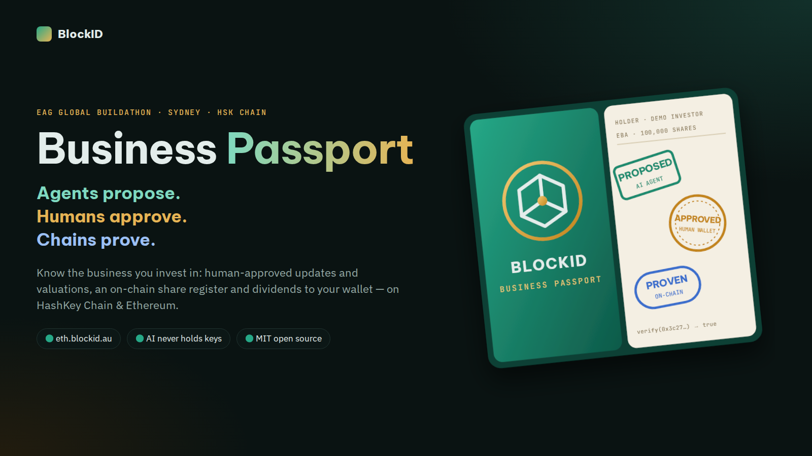
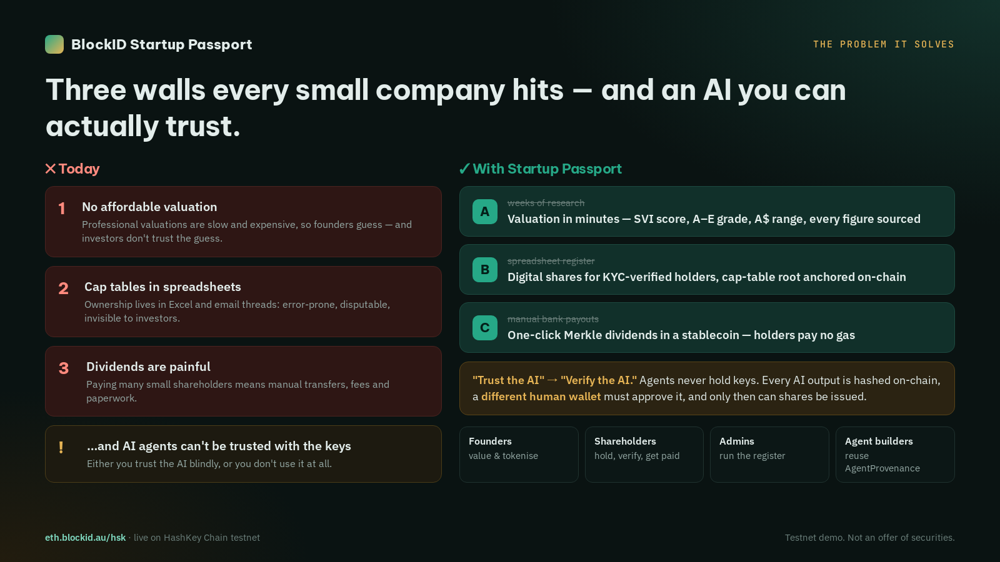
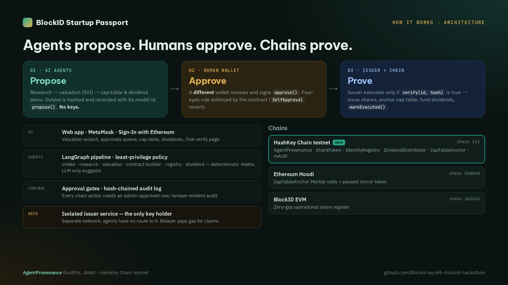
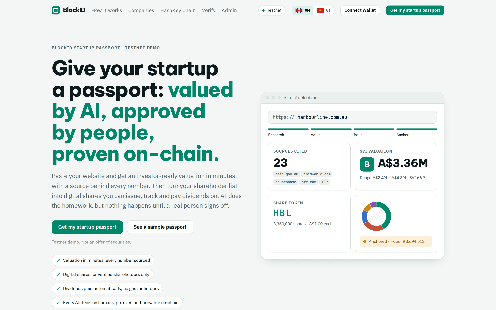
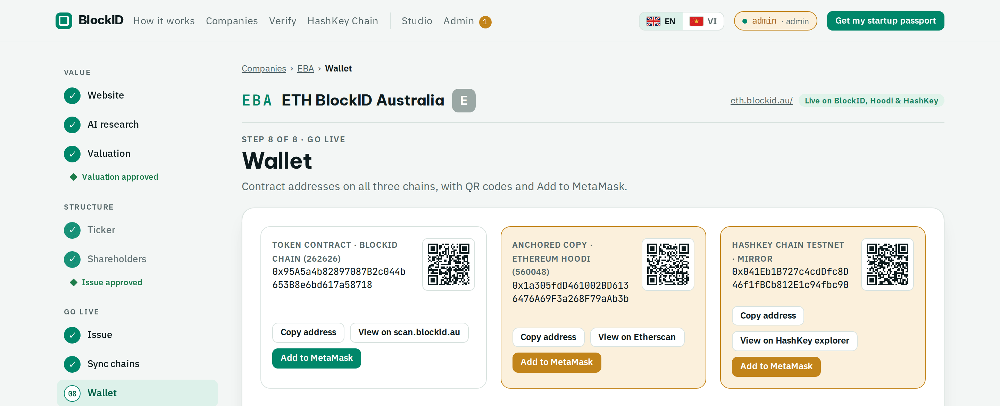
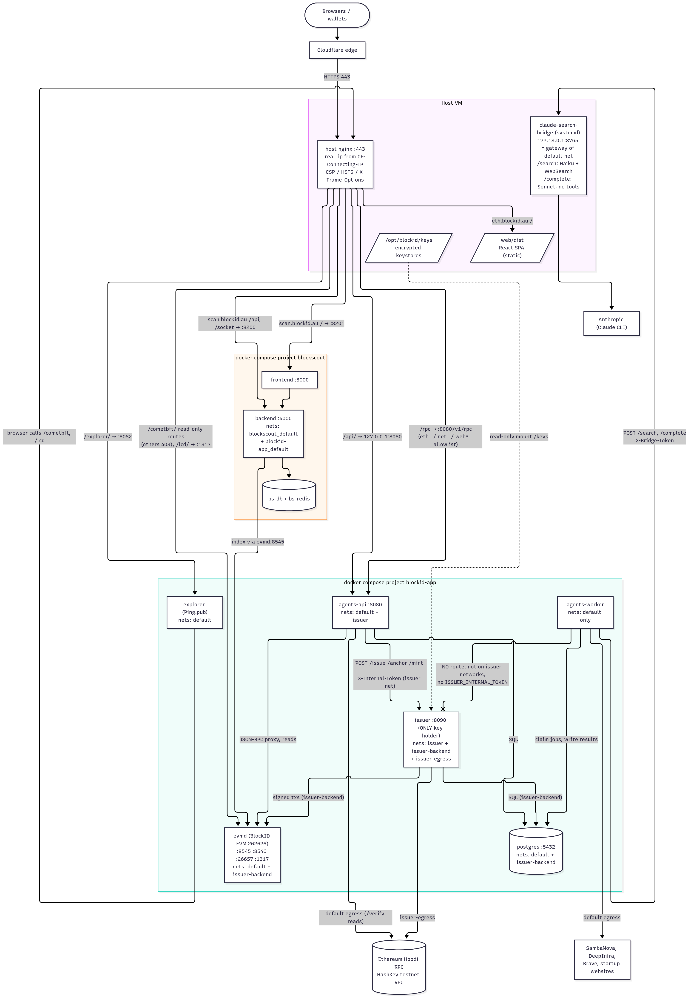
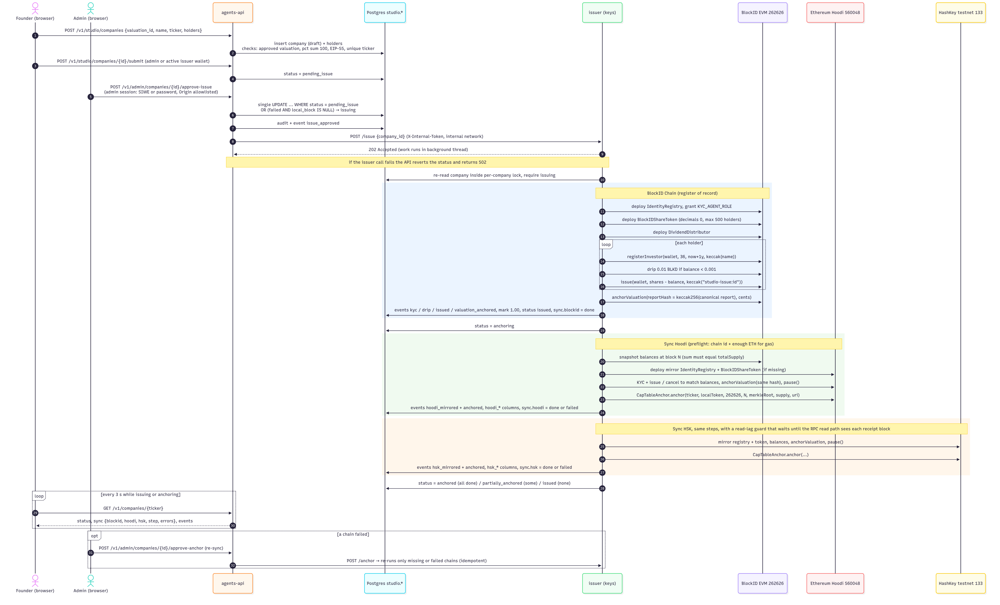

# BlockID Startup Passport



### Agents propose. Humans approve. Chains prove.

*Every startup gets a passport: an AI-researched valuation, a tokenised share register and automatic dividends —
with every AI decision stamped on-chain and signed off by a human.*

**AI agents value startups and tokenise their equity as a real-world asset — but agents never hold keys.**
Every agent proposal is hashed on-chain, a human approves it with their own wallet, and only then does an
isolated issuer service execute.

| | |
|---|---|
| Live app | https://eth.blockid.au |
| HashKey Chain demo page | https://eth.blockid.au/hsk |
| BlockID EVM explorer (Blockscout) | https://scan.blockid.au |
| Hackathon technical doc | [docs/HACKATHON.md](docs/HACKATHON.md) |
| 3-minute demo script | [docs/DEMO.md](docs/DEMO.md) |

> **Testnet demo. Not an offer of securities.**

## Hackathon tracks (EAG Global Buildathon, Sydney)

1. **Sydney Hackathon — AI x Ethereum & Agent Economy.** Agent identity, permissioned agent execution, safe
   spending/execution policies and AI-generated content provenance: each AI output (a valuation, a cap-table
   plan, a dividend plan) is registered on-chain by content hash in `AgentProvenance`, a *different* human wallet
   approves it (four-eyes), and only approved proposals can be marked executed.
2. **HashKey Chain track (RWA / AI Agents).** The full RWA stack — permissioned share token (ERC-3643 style),
   identity registry, Merkle dividend distributor with gasless claims, cap-table anchor and `AgentProvenance` — is
   deployed on **HashKey Chain testnet (chain id 133)** by `scripts/hsk-demo.sh`.

See [docs/HACKATHON.md](docs/HACKATHON.md) for why these tracks and how the build maps to each judging criterion.



## The problem

Small companies and startups — in Australia, Vietnam and other emerging markets — cannot cheaply:

- get an **independent, evidence-backed valuation**;
- run a **compliant share register** (cap tables live in spreadsheets and email threads);
- **pay dividends** to many small shareholders without heavy admin and bank fees.

Tokenisation fixes the register and the payouts, and AI can do the valuation research — but handing an AI agent
the keys to a company's equity is unacceptable. BlockID's answer: **AI proposes, code computes, humans approve,
an isolated issuer signs, and every step is verifiable on-chain.**



## Features

- **AI valuation (SVI — Startup Value Index).** Paste a website; a LangGraph pipeline crawls the public site
  (SSRF-safe fetcher), extracts a profile, discovers competitors via web search, builds a market view and scores
  7 dimensions (Founder 20%, Product 15%, Market 20%, Revenue 20%, Growth 10%, Investment Readiness 10%, Trust 5%).
  Revenue/growth maths is deterministic code; the LLM only *suggests* qualitative scores, each labelled
  `computed | ai_suggested | self_reported | human`. Every claim cites a fetched source URL.
- **Human approval gates.** The valuation pauses at a LangGraph `interrupt()`; an admin approves or overrides
  scores. Issuance, anchoring, extra mints and dividends each need a separate admin approval.
- **Share tokenisation (RWA).** One token = one share (`decimals = 0`, ASX-style 3-letter ticker, default
  A$1.00/share). Only KYC-verified wallets (via `IdentityRegistry`) can hold; lock-up, freeze, pause,
  max-holder cap, forced transfer (lost wallet / court order), and the SHA-256 of the valuation report is anchored
  on the token (`anchorValuation`).
- **Dividends.** Pro-rata plan from on-chain balances (rounded down), OpenZeppelin-compatible Merkle tree,
  `DividendDistributor` round funded in a stablecoin (`DemoAUD` on testnet); a relayer calls `claimFor` so
  shareholders pay no gas.
- **Cross-chain cap-table anchoring.** The operational register lives on the zero-gas BlockID EVM chain; the
  Merkle root of the cap table is anchored on Ethereum Hoodi (`CapTableAnchor.verify` lets anyone prove a
  holder's balance against it).
- **Agent provenance on-chain (new).** `AgentProvenance` records agent identity + policy hash, the content hash
  of each AI proposal, the model id, the human approval/rejection and the execution reference.
- **Tamper-evident audit.** Hash-chained JSON-Lines audit log (`audit.py`) plus a Postgres audit table of every
  admin action.
- **Wallet-native UX.** MetaMask Sign-In with Ethereum (EIP-4361), add-network / add-token buttons, EN default
  with a Vietnamese toggle.

## Documentation

| Doc | What is inside |
|---|---|
| [Feature gallery](docs/FEATURES.md) | Every feature with screenshots from the live app (desktop, mobile, EN/VI) |
| [Architecture diagrams](docs/ARCHITECTURE-DIAGRAMS.md) | 12 diagrams: system context, deployment topology, valuation pipeline, SVI scoring, LLM/search routing, issuance sequence, `/verify`, security boundaries, contracts, data model, state machines |
| [Upgrade roadmap](docs/ROADMAP-RESEARCH.md) | Sourced research: Safe multisig, invariant CI, monitoring, eval harness, EAS, valuation calibration, AU legal path, KYC, ERC-8004 |
| [Security](docs/SECURITY.md) · [Runbook](docs/RUNBOOK-STUDIO.md) · [Demo script](docs/DEMO.md) · [Hackathon write-up](docs/HACKATHON.md) | Operations and judging material |

<p align="center">
  <a href="docs/FEATURES.md"></a>
  <a href="docs/FEATURES.md"></a>
</p>

## Architecture

Detailed diagrams (rendered from Mermaid, sources in [`docs/diagrams/`](docs/diagrams/)):






```
 Founder / investor (MetaMask, SIWE)            Admin / approver (own wallet)
            │                                               │
            ▼                                               ▼
 ┌─────────────────────────── Web (React + viem) ───────────────────────────┐
 └───────────────┬───────────────────────────────────────────┬──────────────┘
                 │ HTTPS /api                                │ approve / reject
                 ▼                                           ▼
 ┌──────────────────── agents-api (FastAPI) ───────────────────────────────┐
 │  auth (SIWE / password) · CSRF · rate limits · approval queue · audit    │
 └───────┬───────────────────────────────────────────────┬─────────────────┘
         │ job queue                                     │ internal token, only for
         ▼                                               │ admin-approved DB rows
 ┌──── AGENT LAYER (no keys) ─────┐                      ▼
 │ agents-worker: LangGraph       │          ┌──── CONTROL PLANE ─────────────┐
 │ site_intake → competitors →    │          │ issuer service (isolated net,  │
 │ market → SVI → narrative →     │          │ only key holder, read-only     │
 │ [gate: human approval]         │          │ keystores) · atomic state       │
 │ policy.py: per-agent tools &   │          │ claims · on-chain result checks │
 │ model tiers, FORBIDDEN_TOOLS   │          └───────────────┬────────────────┘
 │ = sign/send/deploy/keys/shell  │                          │ signed txs
 └────────────────────────────────┘                          ▼
                    ┌──────────────────────── CHAINS ─────────────────────────────┐
                    │ BlockID EVM 262626   IdentityRegistry · ShareToken ·         │
                    │ (zero gas)           DividendDistributor · DemoAUD           │
                    │ Ethereum Hoodi       CapTableAnchor + paused mirror tokens   │
                    │ HashKey testnet 133  full RWA stack + AgentProvenance        │
                    └─────────────────────────────────────────────────────────────┘
```

More detail: [docs/HACKATHON.md](docs/HACKATHON.md), [docs/ARCHITECTURE.md](docs/ARCHITECTURE.md) (Vietnamese),
[docs/IMPLEMENTATION.md](docs/IMPLEMENTATION.md) (API + issuer spec).

## Chains

| Chain | Chain id | Role | Explorer |
|---|---|---|---|
| BlockID EVM (Cosmos EVM, gas price 0) | 262626 | Operational share register: issue, mint, dividends, KYC | https://scan.blockid.au |
| Ethereum Hoodi testnet | 560048 | Public anchor: `CapTableAnchor` Merkle roots + paused mirror tokens | https://hoodi.etherscan.io |
| HashKey Chain testnet | 133 | Full RWA stack + `AgentProvenance` (hackathon deployment) | HashKey testnet explorer |

Existing deployments:

- Hoodi `CapTableAnchor`: `0xF3dC95D5d207dE9f2aC98184Fd32b45B72334263`
- BlockID EVM `DemoAUD`: `0x286C1eD22A741F4939A3C7637011B0fAE2C7FFBc`
- Hoodi end-to-end demo (`scripts/hoodi-demo.sh`): share token `0xf3156Ad6eA559096D4aF350b39984408c764698E`,
  identity registry `0x6B96bcE8937e1416Ec1DAC4ADAdD71FE879F8e84`, dividend distributor
  `0x112C26D5f5d602293f1a00029f5E375763e70282`, mAUD `0xB8F96Eb528C563bFf04661F4062A5799A97D0FcA`

HashKey Chain testnet (chain id 133, RPC `https://testnet.hsk.xyz`):

| Contract | Address | Purpose |
|---|---|---|
| AgentProvenance | [`0x6B96bcE8937e1416Ec1DAC4ADAdD71FE879F8e84`](https://testnet-explorer.hskchain.net/address/0x6B96bcE8937e1416Ec1DAC4ADAdD71FE879F8e84) | AI proposal hash → human approval → execution (four-eyes) |
| BlockIDShareToken (DEM-ORD) | [`0x0107a9aF204113baD3a47a5BF23d84a3302A8cc1`](https://testnet-explorer.hskchain.net/address/0x0107a9aF204113baD3a47a5BF23d84a3302A8cc1) | Permissioned share token, 10,000 shares issued |
| IdentityRegistry | [`0x985cd14495320b1adb2Eb170B62db19b12e901Eb`](https://testnet-explorer.hskchain.net/address/0x985cd14495320b1adb2Eb170B62db19b12e901Eb) | KYC / investor eligibility |
| DividendDistributor | [`0xc0Ad2C03f04ce656Ba5820531a6E45d85C37511e`](https://testnet-explorer.hskchain.net/address/0xc0Ad2C03f04ce656Ba5820531a6E45d85C37511e) | Merkle dividend round, gasless `claimFor` |
| CapTableAnchor | [`0x728c834DE493DC3e9Ae2f7C0e79d86701B6F9F04`](https://testnet-explorer.hskchain.net/address/0x728c834DE493DC3e9Ae2f7C0e79d86701B6F9F04) | Cap-table Merkle root anchored for ticker `DEM` |
| DemoAUD (mAUD) | [`0xD40D9cb55b56b508A9Ee09E3967dAe14a6a0E058`](https://testnet-explorer.hskchain.net/address/0xD40D9cb55b56b508A9Ee09E3967dAe14a6a0E058) | Mock AUD stablecoin used for dividends |

Key transactions (the full *AI proposes → human approves → issuer executes* loop):

| Step | Tx |
|---|---|
| 1. Valuation agent's SVI report hash recorded (`propose`) | [`0x27b9f58a…`](https://testnet-explorer.hskchain.net/tx/0x27b9f58aa16754102e521de4fe1ff787ec327433eaf1df6815e60687f1c36b9f) |
| 2. Human approver wallet signs (`approve`) | [`0xc0e1821d…`](https://testnet-explorer.hskchain.net/tx/0xc0e1821d6a439536f2fc85132a53c893d07da4cacefe12eb2722b4b9a3bce9fa) |
| 3. Shares issued (guarded by `verify`) | [`0xf4d5a5e0…`](https://testnet-explorer.hskchain.net/tx/0xf4d5a5e0d623df3e28201a4eeddcbd361451e967fc6891bcbdb7644c636a9562) |
| 4. Valuation anchored on the share token | [`0x26b1484a…`](https://testnet-explorer.hskchain.net/tx/0x26b1484ade80f8a28ee452e3292d3338b58b9af08bbd2c65485187f93b5e86d4) |
| 5. Cap-table Merkle root anchored | [`0x8f984f02…`](https://testnet-explorer.hskchain.net/tx/0x8f984f02400da39e8dd105be7546dc55a3bd7c734ac4dfa025052b0c56159577) |
| 6. Dividend round funded | [`0x09932f10…`](https://testnet-explorer.hskchain.net/tx/0x09932f105dc1b879c0d82764e5c5e7eb2e4f46a629367803b081d2c530f3b7ef) |
| 7. Proposal marked executed | [`0x8896743f…`](https://testnet-explorer.hskchain.net/tx/0x8896743fc9d7f62857206ccae0ccea407fe9c03d2a71e8b5792680ffccad79e0) |
| 8. Gasless dividend claim (relayer) | [`0x89b1edc1…`](https://testnet-explorer.hskchain.net/tx/0x89b1edc1d65ed7288bc2a3d35ae6d5334b62cebddb26f6597995e070cfab349a) |

### One approval → three chains (live Studio flow)

After a single admin approval the isolated issuer creates the register on BlockID EVM first, then syncs it to
Ethereum Hoodi and HashKey Chain (paused mirror token + cap-table Merkle root + the valuation report hash), with a
live tracker at `/c/:ticker`. Anyone can recompute the report hash in the browser at `/verify/:ticker`.
Example — **EBA (ETH BlockID Australia)**, 3,650,000 shares:

| Chain | Share token | Proof |
|---|---|---|
| BlockID EVM (262626) | [`0x95A5a4b82897087B2c044b653B8e6bd617a58718`](https://scan.blockid.au/token/0x95A5a4b82897087B2c044b653B8e6bd617a58718) | register of record |
| Ethereum Hoodi (560048) | [`0x1a305fdD461002BD6136476A69F3a268F79aAb3b`](https://hoodi.etherscan.io/token/0x1a305fdD461002BD6136476A69F3a268F79aAb3b) | paused mirror + `CapTableAnchor` root |
| HashKey Chain testnet (133) | [`0x041Eb1B727c4cdDfc8D46f1fBCb812E1c94fbc90`](https://testnet-explorer.hskchain.net/address/0x041Eb1B727c4cdDfc8D46f1fBCb812E1c94fbc90) | paused mirror; root anchored in [`0xda0d9934…`](https://testnet-explorer.hskchain.net/tx/0xda0d99340d6a892a6fc1e53d38cf7db8802936d623c55f4d1af06eafaef2e10f) |

Valuation report hash on all three tokens: `0xa1466362b035ecc804caf101986edc4de73697cacf54547226317616c3a73e33`
— check it at https://eth.blockid.au/verify/EBA.

Roles: operator/issuer `0x2567Bb502ac840cF93957C60A410160a8cCb5ddf` · human approver `0xC40052702B48631C26AD7c88b499bF230faCa21F` · relayer `0x1B43f0d3297F79cE6c8BbA12F4FadFBE9112DA4a`.
SVI report hash: `0x3c273fe671ed6024caede1240085a14a67c89a2f94ee08e0f82918af24efebf4` (keccak256 of [`contracts/deployments/params/hsk-svi-report.json`](contracts/deployments/params/hsk-svi-report.json)). Live page: https://eth.blockid.au/hsk

## Repository layout

```
blockid-eth-platform/
├── contracts/            Foundry (Solidity 0.8.28, OpenZeppelin v5.4.0)
│   ├── src/              IdentityRegistry · BlockIDShareToken · DividendDistributor · CapTableAnchor ·
│   │                     DemoAUD · AgentProvenance
│   ├── script/           DeployCompany · DeployPlatform · HoodiDemo (+ HSK demo)
│   ├── test/             unit + fuzz tests, Merkle fixtures
│   └── deployments/out/  deployed addresses per chain (JSON)
├── agents/               Python 3.11+: LangGraph agents, FastAPI API, worker, issuer service
│   └── src/blockid_agents/
│       ├── agents/       site_intake · competitors · research · valuation · contract_builder · registry · dividend · intake
│       ├── tools/        safefetch (SSRF-safe) · search · brave · svi · merkle · captable · ticker · chain · foundry
│       ├── studio/       auth (SIWE) · routes · services · runner · schema.sql
│       ├── issuer/       the only component with keys: chain · keys · merkle · service · app
│       ├── graph.py      fixed step order + human gates (LangGraph interrupt)
│       ├── policy.py     least-privilege policy per agent, enforced in code
│       └── audit.py      hash-chained audit log
├── web/app/              Vite + React + TypeScript + viem (EN default, VI toggle)
├── deploy/               docker compose (app VM, Blockscout), AI VM
├── infra/terraform/      GCP infrastructure
├── scripts/              hoodi-demo.sh · hsk-demo.sh · seed-companies.sh · deploy-company.sh · bootstrap-*.sh
└── docs/                 HACKATHON · DEMO · SECURITY · IMPLEMENTATION · ARCHITECTURE · AGENTS · RUNBOOK*
```

## Quick start (offline, no API spend, no GPU)

Prerequisites: [Foundry](https://book.getfoundry.sh), Python 3.11+, `jq`.

```bash
make contracts-deps              # OpenZeppelin v5.4.0 + forge-std into contracts/lib
pip install -e "agents[dev]"     # Python agents, API, issuer (a virtualenv is recommended)
make test                        # forge test (37 Solidity tests incl. fuzz) + pytest (100 passed, 7 skipped)
make demo                        # offline end-to-end: profile → research → SVI → approval gates →
                                 # contract params → cap table → unsigned Safe batch → dividend Merkle round
```

`make demo` uses fake LLM/search backends, so it needs no keys. Other targets: `make slither` (static analysis),
`make lint` (ruff), `make svi PROFILE=examples/agritrace.json` (live valuation; needs API keys in `.env`, see
`.env.example`).

### Deploy the demo on HashKey Chain testnet

```bash
# needs testnet HSK on the deployer and relayer keystores (encrypted Foundry keystores, never plaintext keys)
scripts/hsk-demo.sh          # deploys the RWA stack + AgentProvenance on chain 133,
                             # writes contracts/deployments/out/hsk-demo.json
```

The equivalent Ethereum Hoodi flow is `scripts/hoodi-demo.sh` (deploy → KYC → issue → anchor valuation → fund a
dividend round → relayer `claimFor` for each shareholder → publish `web/hoodi-demo.json`).

### Run the full stack

The live site runs as a docker compose project (`deploy/vm-app/`): host nginx → `web/dist`, `agents-api`
(FastAPI), `agents-worker` (LangGraph jobs), `issuer` (internal only), Postgres, `evmd` (BlockID EVM node) and
Blockscout. Step-by-step: [docs/RUNBOOK-STUDIO.md](docs/RUNBOOK-STUDIO.md) (single host) and
[docs/RUNBOOK.md](docs/RUNBOOK.md) (GCP). Locally:

```bash
cd agents && PYTHONPATH=src python -m blockid_agents api      # API (FastAPI)
cd agents && PYTHONPATH=src python -m blockid_agents issuer   # issuer service (needs keystores + env)
cd web/app && npm install && npm run dev                       # web app
```

## Technical integration approach

- **Agents → chain only through a human.** Agents output typed Pydantic objects (valuation, cap-table plan,
  dividend plan). The API stores them as rows in a pending state. An admin approves with a SIWE-authenticated
  wallet session; only then does the API call the issuer over an internal network with an internal token. The
  issuer atomically claims the approved row, signs with its own keystore, waits for receipts and records tx
  hashes as events.
- **Provenance.** The issuer records `propose(agentId, kind, contentHash, modelId, uri)` on `AgentProvenance`;
  the human approver calls `approve(id)` / `reject(id, reason)` from their own wallet (must differ from the
  recorder); the issuer calls `markExecuted(id, executionRef)` only after approval. Anyone can call
  `verify(id, contentHash)` to check that a published report is the one that was approved.
- **Standards.** ERC-20 share token with an ERC-3643-compatible `isVerified()` identity check; OpenZeppelin
  AccessControl roles; OpenZeppelin Merkle proofs (double-hashed leaves, sorted pairs) shared by the Python
  builder and Solidity verifier (cross-checked in tests); EIP-4361 SIWE; `wallet_addEthereumChain` /
  `wallet_watchAsset` for UX.
- **Multi-chain by config.** The same compiled contracts deploy to BlockID EVM, Hoodi and HashKey Chain; the issuer
  picks RPC/chain id from environment variables.

## Security model (summary)

- No private key exists in the agent runtime; `sign_tx`, `send_tx`, `read_private_key`, `deploy_contract` and
  `shell` are forbidden for every agent in `policy.py`, enforced in code before every model/tool call.
- Untrusted web content is wrapped as data, outputs are schema-validated, uncited claims are dropped.
- The issuer is the only key holder, on isolated docker networks; the worker that processes untrusted websites
  cannot reach it.
- Admin login: SIWE wallet in `ADMIN_WALLETS`, or a username/password configured via `ADMIN_PASSWORD_HASH`
  (bcrypt, lockout). CSRF origin checks, SSRF-safe fetcher, rate limits, CSP/HSTS.
- Full details and the pre-production checklist (audited ERC-3643/T-REX, Safe multisig, independent audit,
  ASIC/AFSL advice): [docs/SECURITY.md](docs/SECURITY.md).

## Roadmap

- ERC-4337 agent smart accounts with session keys and on-chain spending limits.
- Agent reputation derived from `AgentProvenance` history (approval rate, overrides, post-hoc accuracy).
- Real stablecoin dividends on HashKey Chain; HashKey Chain mainnet deployment.
- ZK selective disclosure of shareholder KYC (prove "verified, AU/VN resident" without revealing identity).
- Move issuance to a Safe multisig; audited T-REX/ONCHAINID; independent audit; licensing advice.
- Open-source SDK of the provenance + approval-gate pattern for other agent builders.

## License

[MIT](LICENSE) © 2026 BlockID. Open source so other teams can reuse the agent-provenance + human-approval pattern (`AgentProvenance.sol`) in their own AI x Ethereum apps. Third-party code (OpenZeppelin, forge-std) keeps its own license.

> **Testnet demo. Not an offer of securities.** Contracts are simplified ERC-3643-compatible versions and have not
> been audited. Nothing here is legal or financial advice.
