# BlockID Startup Passport: architecture diagrams

> **Testnet demo. Not an offer of securities.**

These diagrams describe the system **as deployed** on eth.blockid.au (single VM) and as implemented in this repo.
They were checked against the code (`agents/src/blockid_agents/**`, `contracts/src/*.sol`, `web/app/src/**`),
the compose files in `deploy/`, and the host nginx config. GitHub renders the ```` ```mermaid ```` blocks inline.
Pre-rendered SVG/PNG copies and the `.mmd` sources are in [`docs/diagrams/`](diagrams/).

| # | Diagram | Type |
|---|---|---|
| 1 | [System context](#1-system-context) | flowchart |
| 2 | [Deployment / runtime topology](#2-deployment--runtime-topology) | flowchart |
| 3 | [Valuation pipeline](#3-valuation-pipeline-site_valuation-graph) (+ [SVI scoring](#3b-svi-scoring-and-valuation-formula), [LLM and search routing](#3c-llm-and-web-search-routing)) | flowchart |
| 4 | [Issuance: one approval, three chains](#4-issuance-one-approval-three-chains) | sequence |
| 5 | [Public `/verify` flow](#5-public-verify-flow) | sequence |
| 6 | [Security trust boundaries](#6-security-trust-boundaries) | flowchart |
| 7 | [Smart contracts](#7-smart-contracts) | class |
| 8 | [Data model (`studio.*`)](#8-data-model-studio-schema) | ER |
| 9 | [Company status and per-chain sync states](#9-company-status-state-machine) | state |

---

## 1. System context

Four kinds of people use the system. Founders submit a website and a cap table. Investors and shareholders hold
the tokens. An admin approves every valuation, issuance, mint and dividend. Judges and other public verifiers
recompute report hashes without logging in. Everything is behind Cloudflare. The platform runs its own zero-gas
BlockID EVM chain (262626) as the register of record and mirrors and anchors each cap table on Ethereum Hoodi
(560048) and HashKey Chain testnet (133). The AI side uses SambaNova (free models, tried first) and DeepInfra
(paid, tried last) for LLM calls. Web search goes to Brave first, then to Claude web search through a host bridge.

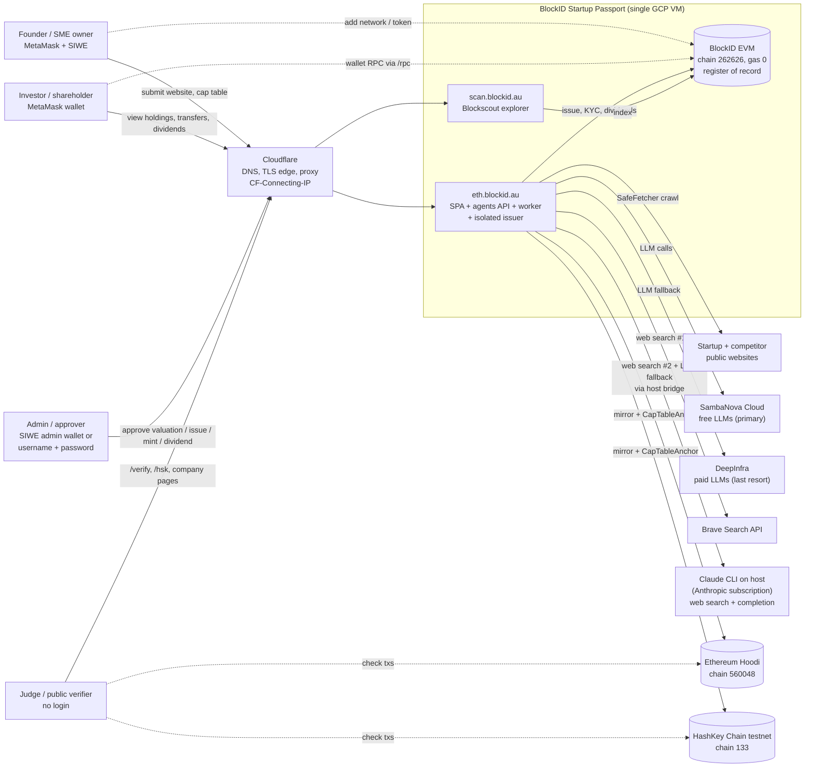

Rendered: [SVG](diagrams/01-system-context.svg) · [PNG](diagrams/01-system-context.png) · source [`01-system-context.mmd`](diagrams/01-system-context.mmd)

---

## 2. Deployment / runtime topology

The host runs nginx on :443. It serves the SPA from `web/dist` and proxies everything else to services that only
listen on `127.0.0.1`. The containers belong to the docker compose project `blockid-app` (`deploy/vm-app`, with
`docker-compose.override.yml` for single-host ports), plus a separate `blockscout` project. The Claude bridge is
a **systemd service on the host**, not a container. It listens on `172.18.0.1:8765`, which is the gateway of
the `blockid-app_default` network, so only containers on that network can call it.

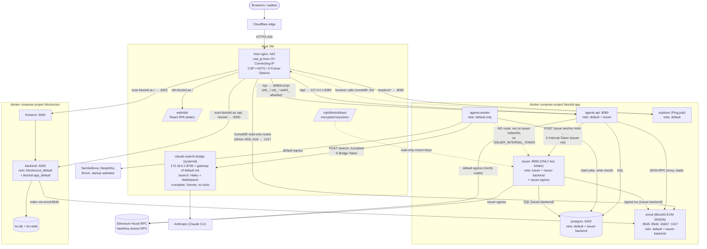

Rendered: [SVG](diagrams/02-deployment-topology.svg) · [PNG](diagrams/02-deployment-topology.png) · source [`02-deployment-topology.mmd`](diagrams/02-deployment-topology.mmd)

**nginx routes (eth.blockid.au).** `/` goes to `web/dist` (SPA, `try_files … /index.html`). `/api/` goes to
`agents-api` :8080, with the prefix stripped. `/rpc` goes to `agents-api /v1/rpc`, a JSON-RPC allowlist proxy
(`eth_*` minus signing and node-account methods, plus `net_*` and `web3_*`, batch ≤ 20, body ≤ 256 KB).
`/cometbft/(status|block|blockchain|block_results|block_by_hash|commit|validators|genesis|abci_info|tx|tx_search|block_search|consensus_params|health)`
goes to evmd :26657, and every other `/cometbft/` path returns 403. `/lcd/` goes to :1317 and `/explorer/` to
Ping.pub on :8082. **scan.blockid.au** sends `/api` and `/socket` to the Blockscout backend on :8200 and
everything else to the frontend on :8201. nginx takes the client IP from `CF-Connecting-IP`, but only when the
request comes from a Cloudflare range (`conf.d/cloudflare-realip.conf`).

**Docker networks (verified with `docker network inspect`).**

| Network | Internal | Members | Purpose |
|---|---|---|---|
| `blockid-app_default` (172.18.0.0/16) | no | agents-api, agents-worker, postgres, evmd, explorer, blockscout backend | app traffic + internet egress for LLM/search/crawl |
| `blockid-app_issuer` | **yes** | agents-api, issuer | the only path to the issuer's :8090 |
| `blockid-app_issuer-backend` | **yes** | issuer, postgres, evmd | issuer → DB and BlockID chain |
| `blockid-app_issuer-egress` | no | issuer only | outbound Hoodi / HSK RPC |
| `blockscout_default` | no | blockscout frontend, backend, db, redis | explorer internals |

`agents-worker` handles untrusted web content, and it is only on `default`. It has no route to the issuer and
does not get `/opt/blockid/issuer.env` (`ISSUER_INTERNAL_TOKEN`). The keystores in `/opt/blockid/keys` are
mounted read-only into the issuer only. The `web` container in the compose file is not used on this host,
because nginx serves `web/dist` directly.

---

## 3. Valuation pipeline (`site_valuation` graph)

The step order is fixed in code (`graph.py`), not by a prompt. Each step is a LangGraph node, and state is
checkpointed in Postgres. The run stops at a human gate (`interrupt()`). The research budget is at most **3 web
searches per valuation**: the competitors query in the competitor step, and the market and valuation-benchmark
queries in the market step. The top 2 results of each search are fetched and stored as evidence (URL, time,
SHA-256).

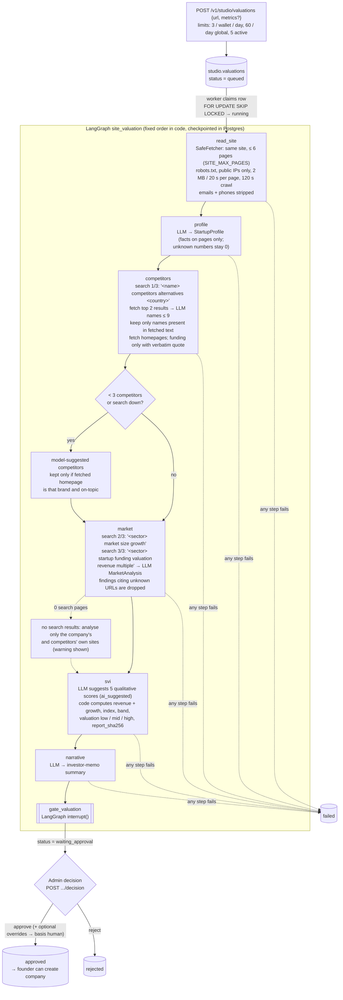

Rendered: [SVG](diagrams/03-valuation-pipeline.svg) · [PNG](diagrams/03-valuation-pipeline.png) · source [`03-valuation-pipeline.mmd`](diagrams/03-valuation-pipeline.mmd)

Controls against hallucination, all enforced in code:

- Competitor names are kept only if they literally appear in the fetched text, and the startup itself is
  removed.
- A funding amount is kept only with a source URL and a verbatim quote from a page fetched in that step.
- Market findings are dropped if they cite a URL that was not fetched.
- Model-suggested competitors are kept only if their fetched homepage names that brand and is on-topic.

After the admin decision, the result is stored in `studio.valuations` (`waiting_approval` → `approved` or
`rejected`). Overrides change a dimension's basis to `human`.

### 3b. SVI scoring and valuation formula

The LLM **only suggests** the 5 qualitative dimension scores. `tools/svi.py` computes revenue performance, growth
capability, the index, the band and the valuation range. The same inputs always give the same output.

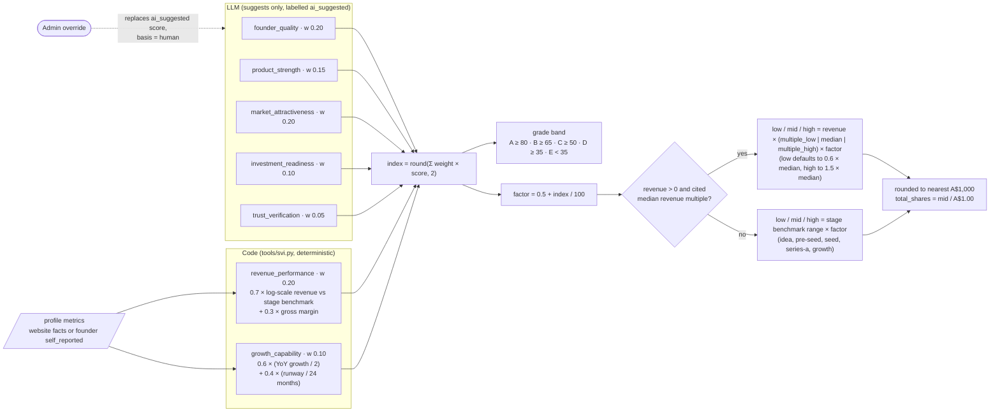

Rendered: [SVG](diagrams/04-svi-scoring.svg) · [PNG](diagrams/04-svi-scoring.png) · source [`04-svi-scoring.mmd`](diagrams/04-svi-scoring.mmd)

### 3c. LLM and web search routing

The live configuration is `LLM_BACKEND=hosted`, `SVI_TIER=cloud`, `LLM_PROVIDER_ORDER=sambanova,claude_bridge,deepinfra`
and `SEARCH_PROVIDERS=brave,claude`. The `local` tier (PII agents) always stays on the LiteLLM gateway and never
falls back to a hosted provider. The first answer that passes the Pydantic schema wins. Each call records which
provider answered in `llm_providers_used`, and the valuation page shows it.

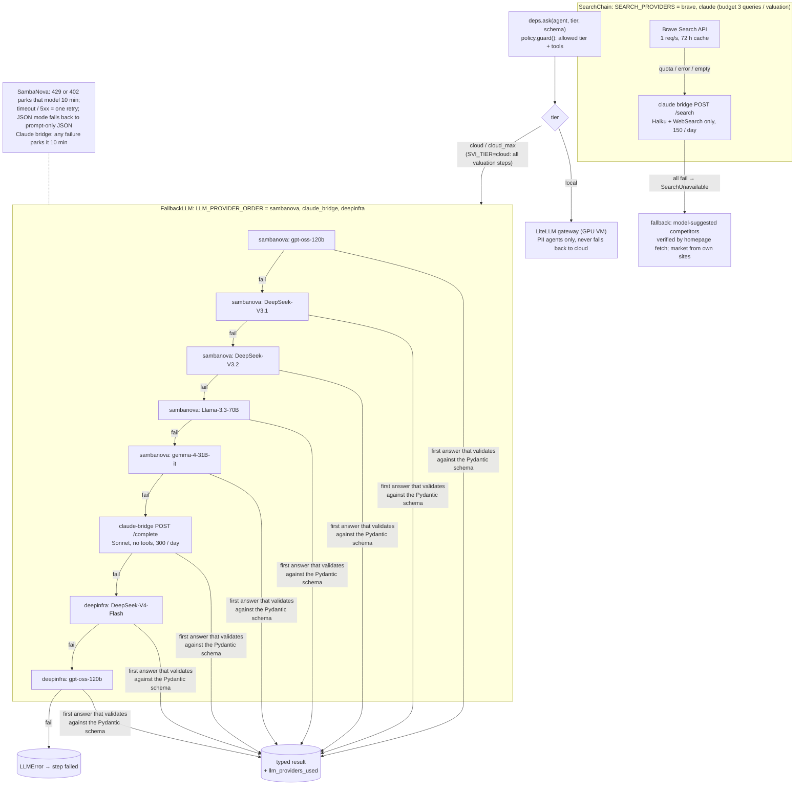

Rendered: [SVG](diagrams/05-llm-search-routing.svg) · [PNG](diagrams/05-llm-search-routing.png) · source [`05-llm-search-routing.mmd`](diagrams/05-llm-search-routing.mmd)

---

## 4. Issuance: one approval, three chains

The founder creates the company as a `draft` and submits it (`pending_issue`). **One** admin approval starts the
whole chain:

1. The API flips the status with a single guarded `UPDATE` (the atomic claim).
2. The API calls the issuer over the internal network with `X-Internal-Token`.
3. The issuer issues on BlockID Chain.
4. The issuer syncs Ethereum Hoodi, then HashKey testnet, with no second gate.

Each external chain gets a **paused** mirror token with the same balances, the same `valuationReportHash`, and a
`CapTableAnchor.anchor` of the OpenZeppelin Merkle root over `(holder, balance)` at BlockID block N. A failure
on one chain is recorded per chain and does not block the next one. Retries are idempotent: deployed contracts
are reused, only balance differences are issued, and paid claims are skipped.

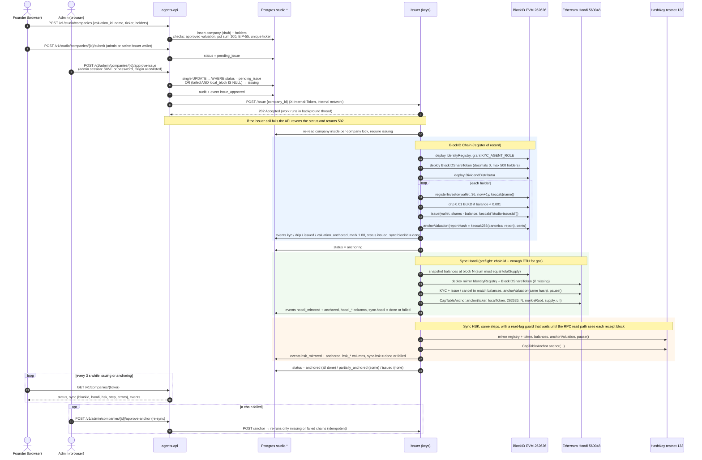

Rendered: [SVG](diagrams/06-issuance-sequence.svg) · [PNG](diagrams/06-issuance-sequence.png) · source [`06-issuance-sequence.mmd`](diagrams/06-issuance-sequence.mmd)

The founder's tracker (`/c/:ticker`) polls `GET /v1/companies/{ticker}` every 3 s while the status is
`issuing` or `anchoring`, then every 15 s while the status is transient, and shows `sync.step`
(`{chain, action, n, of}`). Mints and dividends use the same pattern. Their rows are claimed atomically
(`approved` → `minting`, and `approved` → `paying`). The relayer pays gas for `claimFor`, and a mint re-anchors
every external chain that was already synced.

---

## 5. Public `/verify` flow

`/verify/:ticker` lets anyone check that the valuation report shown is exactly the one anchored on-chain. The
report is the subset `{url, profile, competitors, market, svi, self_reported}` of the API valuation view.
It is hashed as `keccak256(utf8(canonical JSON))`, where canonical JSON means keys sorted recursively,
separators `(",", ":")` and no ASCII escaping (`studio/report_hash.py`, `web/app/src/lib/canonical.ts`).

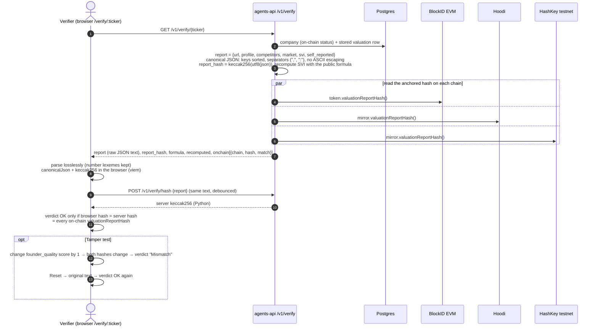

Rendered: [SVG](diagrams/07-verify-flow.svg) · [PNG](diagrams/07-verify-flow.png) · source [`07-verify-flow.mmd`](diagrams/07-verify-flow.mmd)

The page also recomputes the SVI index, band and valuation from the report's own inputs with the public formula
(`GET /v1/verify` returns `formula` and `recomputed`). A reader can see that the numbers follow from the scores,
not only that the bytes match.

---

## 6. Security trust boundaries

There are three zones. The **edge** is Cloudflare plus nginx. The **application zone** holds the API, the
worker, the SafeFetcher and Postgres, and has no keys. The **key zone** holds only the issuer, on internal
networks plus an egress-only network. Untrusted web content enters only through the SafeFetcher into the worker.
Nothing reaches a chain except through an admin-approved row that the issuer claims atomically.

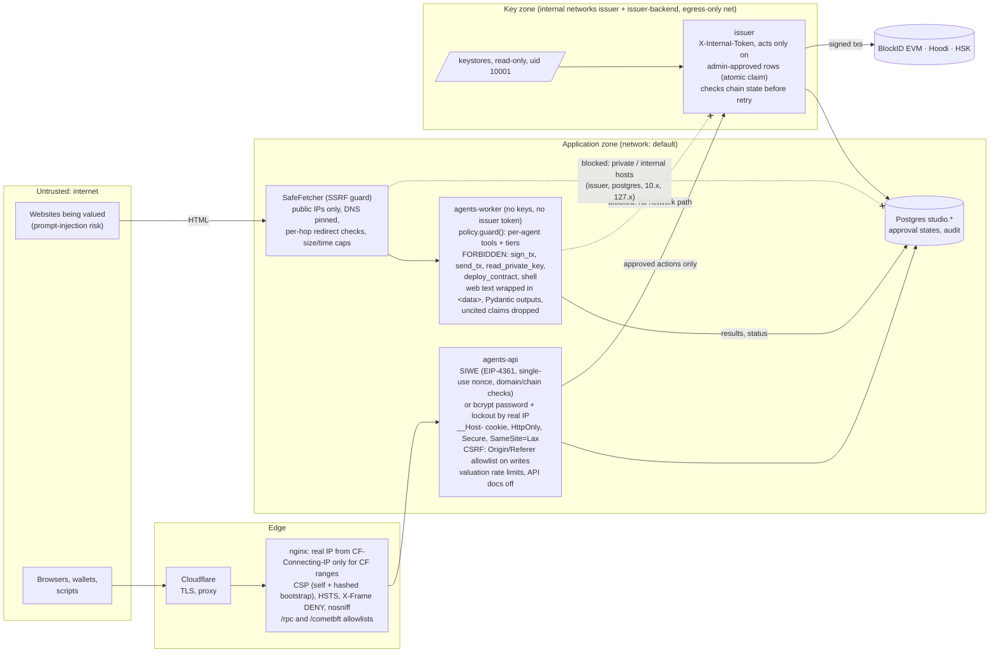

Rendered: [SVG](diagrams/08-security-boundaries.svg) · [PNG](diagrams/08-security-boundaries.png) · source [`08-security-boundaries.mmd`](diagrams/08-security-boundaries.mmd)

| Boundary | Control | Where |
|---|---|---|
| Browser → API | SIWE (EIP-4361, single-use nonce, domain/URI/chain checks) or admin password (bcrypt, 5 failures / 15 min per real IP); cookie `__Host-bid_session`; Origin/Referer allowlist on every non-GET (except the cookie-less `/v1/rpc`) | `studio/auth.py`, `api.py` |
| Public RPC | `/rpc` method allowlist; `/cometbft/` read-only routes | `studio/routes.py`, nginx |
| Web content → agents | SafeFetcher (public IPs only, DNS pinned, per-hop redirect checks, 2 MB / 20 s per page, 120 s per crawl, robots.txt); `<data>` wrapping; Pydantic outputs; uncited claims dropped | `tools/safefetch.py`, agents |
| Agents → tools / models | `policy.guard()` per agent; `FORBIDDEN_TOOLS`; PII agents local tier only | `policy.py` |
| API → issuer | internal network + `X-Internal-Token`; only admin-approved rows; atomic status claims; revert on issuer error | `studio/routes.py`, `issuer/app.py` |
| Keys | encrypted keystores, read-only mount, issuer container only | compose, `issuer/keys.py` |
| Abuse | valuations: 3 / wallet / day, 60 / day global, 5 active | `studio/services.py` |
| Web | CSP (self + hashed bootstrap script, Google Fonts, Hoodi RPC, scan.blockid.au), HSTS, X-Frame-Options DENY, nosniff, Permissions-Policy; API docs disabled | nginx snippet, `api.py` |

---

## 7. Smart contracts

All contracts are Solidity 0.8.28 on OpenZeppelin v5.4.0. The same bytecode is deployed on all three chains. In
the Studio flow, the issuer key receives `DEFAULT_ADMIN_ROLE`, `ISSUER_ROLE`, `PAUSER_ROLE` and
`TRANSFER_AGENT_ROLE` on each company token, and `KYC_AGENT_ROLE` on its registry. `CapTableAnchor` is deployed
once per external chain and grants `ANCHOR_ROLE` to the issuer.

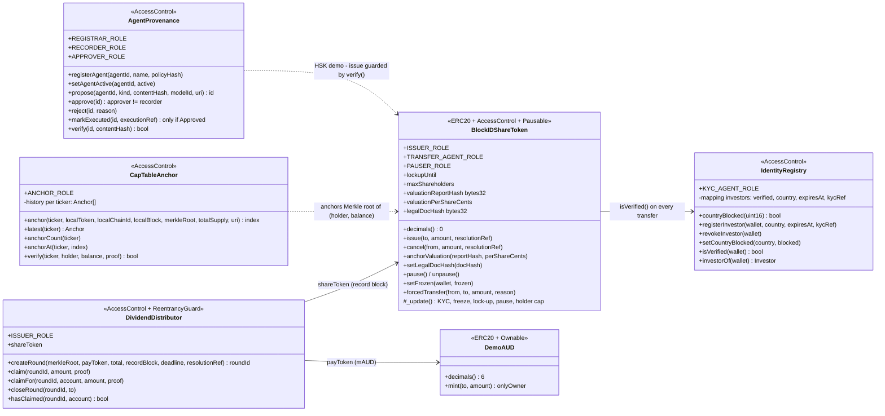

Rendered: [SVG](diagrams/09-contracts-class.svg) · [PNG](diagrams/09-contracts-class.png) · source [`09-contracts-class.mmd`](diagrams/09-contracts-class.mmd)

Notes:

- `BlockIDShareToken._update` checks `isVerified(to)` on every mint and transfer. For ordinary transfers it also
  enforces pause, freeze, lock-up and `isVerified(from)`. `forcedTransfer` bypasses pause, freeze and lock-up,
  but not KYC of the receiver. Holder count is capped (`maxShareholders`, 500 in the Studio).
- `AgentProvenance` enforces four-eyes approval on-chain: the approver must differ from the recorder, and
  `markExecuted` works only after approval. It is deployed and exercised by `scripts/hsk-demo.sh` on HashKey
  testnet. The live Studio issuer does **not** call it yet. The Studio anchors the report hash through
  `anchorValuation` instead.
- `DemoAUD` (mAUD, 6 decimals) is the dividend pay token on BlockID Chain. `DividendDistributor` rounds use
  OpenZeppelin double-hashed Merkle leaves, the same scheme as `CapTableAnchor.verify`.

---

## 8. Data model (`studio` schema)

The schema is `agents/src/blockid_agents/studio/schema.sql`, applied idempotently when the API starts. Some
tables are not shown as related because they have no foreign keys: `admin_users`, `sessions`, `nonces`,
`issuer_wallets` and `audit`. Actors appear as a wallet address or username in text columns such as
`requested_by`, `created_by` and `audit.actor`. Evidence pages and the search cache live in
`/data/evidence.sqlite`, and the hash-chained agent audit log lives in `/data/audit.jsonl`, both on the shared
`/mnt/app-data/agents` volume. LangGraph checkpoints are stored in Postgres.

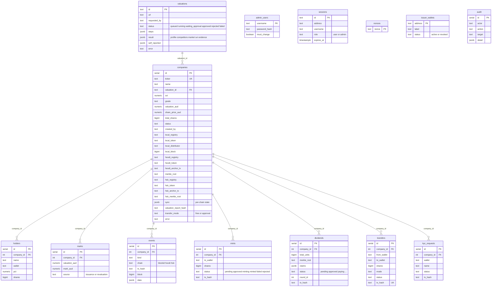

Rendered: [SVG](diagrams/10-data-model-er.svg) · [PNG](diagrams/10-data-model-er.png) · source [`10-data-model-er.mmd`](diagrams/10-data-model-er.mmd)

`events.kind` includes `submitted, issue_approved, deployed, kyc, drip, issued, valuation_anchored,
sync_started, hoodi_mirrored, hsk_mirrored, anchored, sync_failed, sync_skipped, resync_requested, revalued,
mint_requested, minted, dividend_created, dividend_claimed, transfer_requested, transferred, transfer_mode, rejected`.

---

## 9. Company status state machine

`studio.companies.status` is written by the API (draft, pending_issue, issuing, rejected, and reverts when the
issuer is unreachable) and by the issuer (issued, anchoring, anchored, partially_anchored, failed).
`pending_anchor` is a legacy status that is still accepted but is no longer entered, because anchoring now
follows issuance automatically.

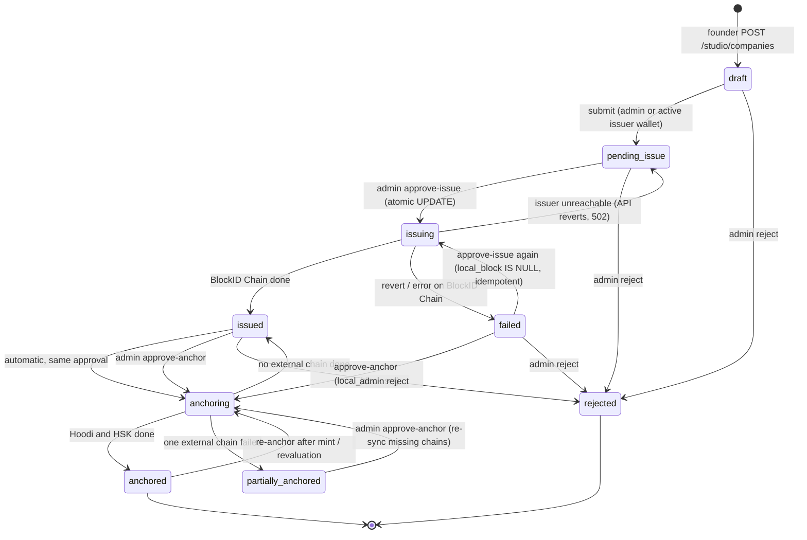

Rendered: [SVG](diagrams/11-company-state-machine.svg) · [PNG](diagrams/11-company-state-machine.png) · source [`11-company-state-machine.mmd`](diagrams/11-company-state-machine.mmd)

### Per-chain sync states (`studio.companies.sync`, written only by the issuer)

Each chain is in one of `pending | running | done | failed | skipped`. The company status after a sync pass
comes from `syncstate.overall()`. It is `anchored` if every external chain is done, `partially_anchored` if at
least one is done, and `issued` if none is. Admin re-sync (`approve-anchor`) re-runs only the chains that
`syncstate.missing()` reports.

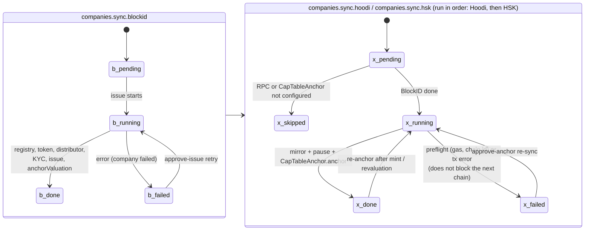

Rendered: [SVG](diagrams/12-chain-sync-states.svg) · [PNG](diagrams/12-chain-sync-states.png) · source [`12-chain-sync-states.mmd`](diagrams/12-chain-sync-states.mmd)

---

### Where the older docs differ from the code

- `docs/IMPLEMENTATION.md` describes a separate `approve-anchor` gate for Hoodi and `anchorValuation(keccak(valuation id))`.
  The current code runs Hoodi and HSK automatically after the single `approve-issue`, and anchors
  `keccak256(canonical report JSON)`. `approve-anchor` is now only a retry / re-sync.
- `docs/ARCHITECTURE.md` (§1) shows the earlier two-VM design (Caddy, GPU VM, Sepolia). The live system is the
  single VM shown in diagram 2, with Ethereum Hoodi.
- `docs/RUNBOOK-STUDIO.md` mentions "DeepInfra + Brave" for the worker. The live LLM chain is SambaNova → Claude
  bridge → DeepInfra, and search is Brave → Claude bridge (see diagram 3c and `docs/LLM-ROUTING.md`).

### Re-rendering

```bash
cd docs/diagrams
for f in *.mmd; do n=${f%.mmd}
  sudo docker run --rm -u $(id -u):$(id -g) -v $PWD:/data minlag/mermaid-cli -i /data/$f -o /data/$n.svg -b white
  sudo docker run --rm -u $(id -u):$(id -g) -v $PWD:/data minlag/mermaid-cli -i /data/$f -o /data/$n.png -b white --size 3000
done
```
