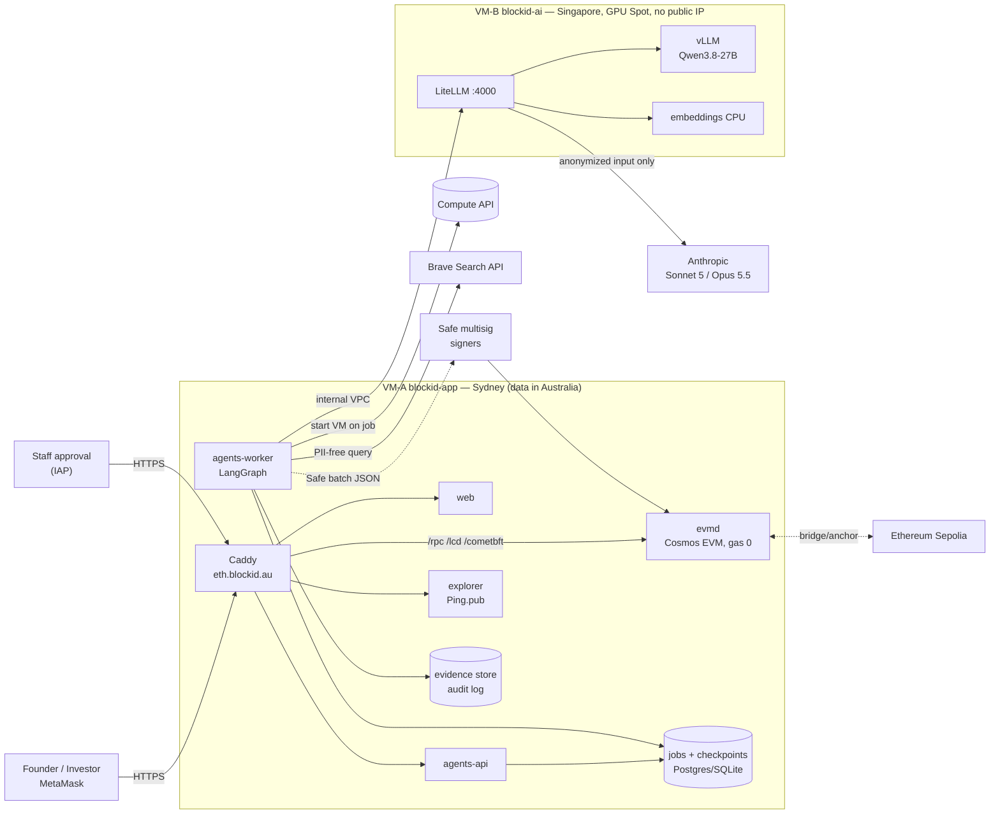

# Architecture

> **Note:** §1 describes the original two-VM GCP design (Caddy, Sepolia). The live single-host deployment (nginx, Hoodi + HashKey, isolated issuer) is documented in [ARCHITECTURE-DIAGRAMS.md](ARCHITECTURE-DIAGRAMS.md).


## 1. Overview



## 2. Business flow (order enforced by code, not by the prompt)

```
ONBOARDING
intake ─▶ research ─▶ valuation ─▶ [GATE 1: approve/edit SVI score] ─▶ contract_builder
   ─▶ [GATE 2: approve parameters + HUMAN deploy + submit cap table] ─▶ registry ─▶ Safe batch ─▶ signers

DIVIDEND
plan (snapshot → pro-rata → Merkle) ─▶ [GATE 3: match against board resolution] ─▶ Safe batch ─▶ signers
```

Each gate is a LangGraph `interrupt()`: the workflow stops, state is saved to a checkpoint, and it only resumes once a decision with the approver's name is submitted through the API. Gate 2 **hard-rejects** if the forge tests, dry-run deploy, or Slither (High/Medium) fail, even if the approver clicks approve.

## 3. Background (batch) AI mode + Brave

None of BlockID's features require an instant AI response, so:

1. The API only **enqueues the job** and returns `202`. The UI polls for status.
2. The worker picks up the job. If the job needs the local model and the GPU VM is off, the worker calls the Compute API to **start the VM** and waits for the gateway to become ready.
3. The GPU VM runs on **Spot** (much cheaper than on-demand). If Google reclaims it mid-job, the job is retried from the last checkpoint, up to 3 times.
4. `idle-shutdown.sh` **automatically shuts down the VM** after `IDLE_MINUTES` minutes without a request (default 20). After that, only disk storage is billed.
5. Since fast responses aren't required, a larger model/quantization, longer context, and more source pages can be used.

**Research agent + Brave:** build a neutral query (strip email/phone numbers) → call Brave web + news (72h cache to save quota) → fetch pages → save to the evidence store (URL, timestamp, SHA-256) → **local Qwen** analyzes and must cite a URL for every claim. Any claim citing a URL not in the fetched list is automatically discarded.

## 4. Model tiering (LiteLLM, switch models with a single config line)

| Tier | Model | Used for | Data |
|---|---|---|---|
| `local` | Qwen3.8-27B (vLLM, 4-bit on L4) | intake, research, valuation, registry, dividend | may contain PII (data never leaves the server) |
| `cloud` | Claude Sonnet 5 | contract parameter review | anonymized data only |
| `cloud_max` | Claude Opus 5.5 | final security review, escalation cases | anonymized data only |

- **No fallback from local to cloud**, so PII can never "leak" out if the GPU fails.
- LiteLLM sets a monthly `max_budget` for cloud spend.

## 5. Estimated cost (USD/month, reference us-central1 pricing; Sydney/Singapore slightly higher)

| Item | 24/7 | Batch mode (e.g. 4 GPU hours/day, Spot) |
|---|---|---|
| VM-A n2-standard-8 + SSD 500GB | ~300–400 | ~300–400 |
| VM-B g2-standard-8 (L4) | ~620 (on-demand) | **~40–60** (about 120 Spot hours) + disk ~20 |
| Claude API (review) | 20–100 | 20–100 |
| Brave Search | per your plan | per plan (with cache) |

Upgrade path: change `ai_machine_type = "g4-standard-48"` (RTX PRO 6000 96GB), set `MODEL_ID` to the FP8 build, and increase `MAX_LEN`. No code changes required.

## 6. Smart contracts

| Contract | Role |
|---|---|
| `IdentityRegistry` | wallet ↔ KYC status, country, expiry; stores only the **hash** of the KYC profile, no PII on-chain. `isVerified()` interface matches ERC-3643 |
| `BlockIDShareToken` | 1 token = 1 share (decimals 0); only KYC'd wallets can receive; lock-up, freeze, pause, shareholder cap (default 50 for a Pty Ltd), forced transfer (lost wallet/court order), anchors the SVI report hash + constitution hash |
| `DividendDistributor` | pull-based dividend distribution: Merkle root per round, stablecoin, `claimFor` so a relayer can pay gas, issuer reclaims unclaimed amounts after expiry |

All issuer/admin rights belong to the **Safe multisig**. The deployer only holds temporary admin rights to configure the contracts, then renounces them within the same script.

## HashKey Chain testnet (EAG hackathon)

The full RWA stack (`IdentityRegistry`, `BlockIDShareToken`, `DividendDistributor`, `DemoAUD`, `CapTableAnchor`) plus the new `AgentProvenance` contract are deployed on HashKey Chain testnet (chain id 133) via `scripts/hsk-demo.sh`. `AgentProvenance` records the hash of each AI agent output (proposed by the issuer service), requires a **different human wallet** to approve it (four-eyes principle), and only then can the issuer execute the action (issuance is guarded by `AgentProvenance.verify`) and call `markExecuted`. Contract addresses are listed in `README.md` and on the web page https://eth.blockid.au/hsk.
