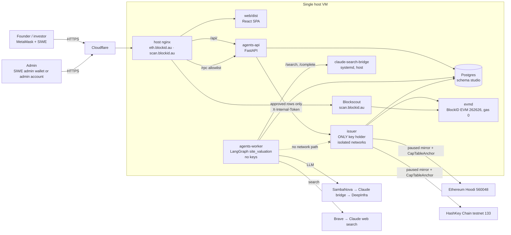
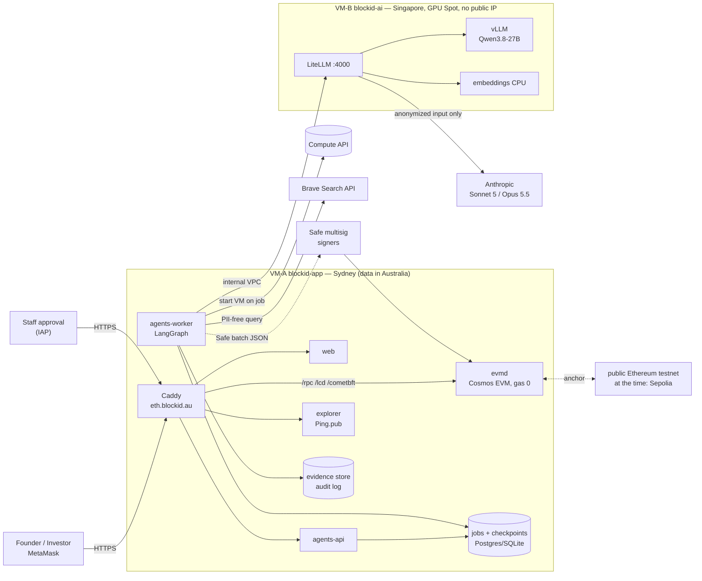

# Architecture

BlockID Business Passport — *Agents propose. Humans approve. Chains prove.* Detailed, code-verified diagrams:
[ARCHITECTURE-DIAGRAMS.md](ARCHITECTURE-DIAGRAMS.md). Canonical facts: [FACTS.md](FACTS.md).

## 1. Overview (live deployment, single host)

Everything runs on one GCP VM behind Cloudflare: host nginx, a docker compose project `blockid-app`
(`deploy/vm-app/`), a Blockscout project (`deploy/blockscout/`) and a systemd Claude bridge on the host.



| Piece | Where | Notes |
|---|---|---|
| Web (SPA) | `web/dist`, host nginx | Vite + React + viem, EN default, VI toggle |
| `agents-api` | container, `127.0.0.1:8080` | auth (SIWE / admin account), CSRF, rate limits, approval queue, audit, `/v1/verify` |
| `agents-worker` | container, network `default` only | runs `site_valuation` jobs; never receives `ISSUER_INTERNAL_TOKEN` |
| `issuer` | container, internal `:8090` | only key holder (`/opt/blockid/keys`, read-only); networks `issuer`, `issuer-backend`, egress-only |
| `evmd` | container, RPC `127.0.0.1:8545` | BlockID EVM (Cosmos EVM), chain id 262626, gas price 0 |
| Blockscout | `deploy/blockscout` | https://scan.blockid.au |
| Claude bridge | systemd `claude-search-bridge` | `POST /search` (Claude web search) and `POST /complete` (Sonnet, no tools) |

Operations: [RUNBOOK-STUDIO.md](RUNBOOK-STUDIO.md). Security controls: [SECURITY.md](SECURITY.md).

## 2. Business flow (order enforced by code, not by the prompt)

```
VALUATION (LangGraph site_valuation, worker, no keys)
read_site → profile → competitors → market → svi → narrative → [GATE: admin approves / overrides SVI]

ISSUANCE (issuer, after ONE admin approval)
founder enters shareholders → submit → [ONE issuance approval] →
  BlockID EVM: IdentityRegistry, BlockIDShareToken, DividendDistributor, KYC each holder, gas drip, issue,
               anchorValuation(reportHash)
  → Ethereum Hoodi: paused mirror (same balances) + CapTableAnchor Merkle root      (automatic)
  → HashKey Chain testnet: paused mirror + CapTableAnchor Merkle root               (automatic)
  a failed chain never blocks the next; admin "re-sync" (approve-anchor) re-runs only missing/failed chains

AFTER ISSUANCE (each needs an admin approval)
mint (dilution preview) · Merkle dividend in mAUD with relayer claimFor · revaluation (mark = valuation ÷ shares)
```

- The valuation gate is a LangGraph `interrupt()`: state is checkpointed in Postgres and resumes only on a
  named admin decision.
- The anchored `reportHash` is keccak256 of the canonical report JSON (`studio/report_hash.py`: keys
  `url, profile, competitors, market, svi, self_reported`, keys sorted, separators `,`/`:`). `/verify/:ticker`
  recomputes it in the browser and compares it with `valuationReportHash()` on all three chains.
- Default issue price A$1.00 per share: shares = approved mid valuation ÷ 1.
- The issuer claims approved rows atomically, checks chain state before any retry and records every tx as an event.

The legacy data-room flow (`intake → research → valuation → gate → contract_builder → gate → registry`, unsigned
Safe batches) is still in `graph.py` for `make demo`; see [AGENTS.md](AGENTS.md).

## 3. LLM and web search

- Cloud tier (all live valuation steps, `SVI_TIER=cloud`): **SambaNova → Claude CLI bridge → DeepInfra**
  (`LLM_PROVIDER_ORDER=sambanova,claude_bridge,deepinfra`); the first answer that validates against the Pydantic
  schema wins.
- Web search: **Brave → Claude web-search bridge**, at most **3 searches per valuation**; model-suggested
  competitors are kept only after their homepage is fetched and checked.
- The `local` tier (PII-handling legacy agents) is never allowed to fall back to cloud (`policy.guard`).

Details and benchmark: [LLM-ROUTING.md](LLM-ROUTING.md).

## 4. Smart contracts

| Contract | Role |
|---|---|
| `IdentityRegistry` | wallet ↔ KYC status, country, expiry; stores only a **hash** of the KYC record, no PII on-chain; ERC-3643-style `isVerified()` |
| `BlockIDShareToken` | 1 token = 1 share (decimals 0); only KYC'd wallets can receive; lock-up, freeze, pause, holder cap, forced transfer; `anchorValuation(reportHash, perShareCents)` / `valuationReportHash()` |
| `DividendDistributor` | pull-based dividends: Merkle root per round, stablecoin (`DemoAUD`/mAUD on testnet), `claimFor` so a relayer pays gas, unclaimed funds reclaimed after expiry |
| `CapTableAnchor` | Merkle root of `(holder, balance)` per ticker on Hoodi and HashKey; `verify()` proves a holding |
| `AgentProvenance` | HashKey Chain: AI output hash → different human wallet approves (four-eyes) → `markExecuted` |
| `DemoAUD` | testnet stablecoin (6 decimals) |

On testnet the issuer key (`0x2567…5ddf`) holds the admin and issuer roles (a hot key on the server). Moving admin
roles to a Safe multisig and narrowing the issuer to `ISSUER_ROLE` is roadmap item 1
([ROADMAP-RESEARCH.md](ROADMAP-RESEARCH.md)).

## 5. HashKey Chain testnet (EAG hackathon)

Every company issued through the live flow gets a paused mirror token and a cap-table root on HashKey Chain
testnet (chain id 133) automatically. In addition, the full RWA stack (`IdentityRegistry`, `BlockIDShareToken`,
`DividendDistributor`, `DemoAUD`, `CapTableAnchor`) plus `AgentProvenance` was deployed with `scripts/hsk-demo.sh`.
`AgentProvenance` records the hash of each AI output (proposed by the issuer service), requires a **different human
wallet** to approve it, and only then can the issuer execute (issuance guarded by `AgentProvenance.verify`) and call
`markExecuted`. Addresses: `README.md` and https://eth.blockid.au/hsk.

---

## Appendix A. Earlier target design (two-VM GCP, superseded)

The first design, kept for reference. It is **not** what runs today: the live system is the single host in §1,
anchors on Ethereum Hoodi and HashKey (not Sepolia), uses nginx (not Caddy), a cloud LLM chain (not a GPU VM) and an
isolated issuer service (not Safe batches signed by humans).



**Background (batch) AI mode.** The API enqueues a job and returns `202`; the worker starts the GPU VM on demand
(Spot, retried from the last checkpoint up to 3 times if reclaimed) and `idle-shutdown.sh` stops it after
`IDLE_MINUTES` (default 20). The research agent built PII-free Brave queries (72 h cache), stored fetched pages in
the evidence store and discarded claims citing unfetched URLs — this part lives on in the live pipeline.

**Model tiering (LiteLLM).**

| Tier | Model | Used for | Data |
|---|---|---|---|
| `local` | Qwen3.8-27B (vLLM, 4-bit on L4) | intake, research, valuation, registry, dividend | may contain PII |
| `cloud` | Claude Sonnet 5 | contract parameter review | anonymized only |
| `cloud_max` | Claude Opus 5.5 | final security review, escalation | anonymized only |

No fallback from local to cloud; LiteLLM `max_budget` capped cloud spend.

**Estimated cost (USD/month).** VM-A n2-standard-8 + 500 GB SSD ~300–400; VM-B g2-standard-8 (L4) ~620 on-demand
or ~40–60 in batch Spot mode + ~20 disk; Claude review 20–100; Brave per plan. Terraform for this design is in
`infra/terraform/`; the GCP runbook is [RUNBOOK.md](RUNBOOK.md).

**Admin rights.** In this design all issuer/admin rights belonged to a Safe multisig and the deployer renounced its
temporary admin role in the same script. The live testnet uses the issuer hot key instead (see §4).
