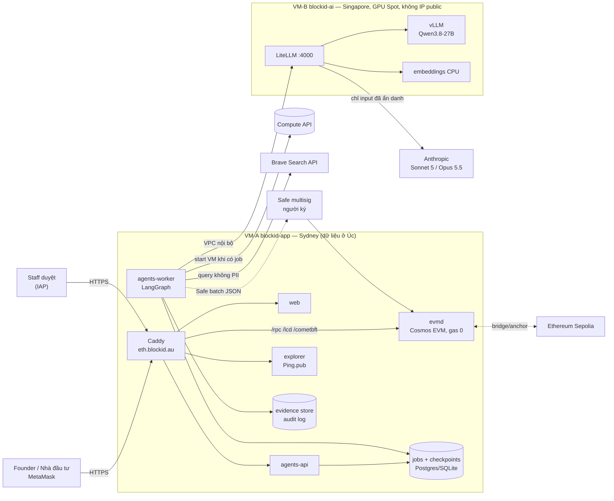

# Kiến trúc

## 1. Tổng quan



## 2. Luồng nghiệp vụ (thứ tự do code quy định, không phải prompt)

```
ONBOARDING
intake ─▶ research ─▶ valuation ─▶ [CỔNG 1: duyệt/sửa điểm SVI] ─▶ contract_builder
   ─▶ [CỔNG 2: duyệt tham số + NGƯỜI deploy + nộp cap table] ─▶ registry ─▶ Safe batch ─▶ người ký

DIVIDEND
plan (snapshot → pro-rata → Merkle) ─▶ [CỔNG 3: khớp nghị quyết HĐQT] ─▶ Safe batch ─▶ người ký
```

Mỗi cổng là một `interrupt()` của LangGraph: workflow dừng, trạng thái lưu vào checkpoint, và chỉ chạy tiếp khi có quyết định kèm tên người duyệt qua API. Cổng 2 **từ chối cứng** nếu forge test, dry-run deploy hoặc Slither (High/Medium) thất bại, kể cả khi người duyệt bấm đồng ý.

## 3. Chế độ AI chạy nền (batch) + Brave

Không tính năng nào của BlockID cần AI trả lời tức thì, nên:

1. API chỉ **xếp job vào hàng đợi** và trả `202`. UI hỏi lại trạng thái (poll).
2. Worker lấy job. Nếu job cần model local mà VM GPU đang tắt, worker gọi Compute API để **bật VM** và chờ gateway sẵn sàng.
3. VM GPU chạy **Spot** (rẻ hơn nhiều so với on-demand). Nếu bị Google thu hồi giữa chừng, job được thử lại từ checkpoint cuối, tối đa 3 lần.
4. `idle-shutdown.sh` **tự tắt VM** sau `IDLE_MINUTES` phút không có request (mặc định 20). Khi đó chỉ còn tính tiền ổ đĩa.
5. Vì không cần phản hồi nhanh, có thể chọn model/lượng tử lớn hơn, context dài hơn, và đọc nhiều trang nguồn hơn.

**Research agent + Brave:** dựng query trung lập (xoá email/số điện thoại) → gọi Brave web + news (có cache 72h để tiết kiệm quota) → tải trang → lưu vào evidence store (URL, thời điểm, SHA-256) → **Qwen local** phân tích và bắt buộc trích URL cho từng nhận định. Nhận định nào trích URL không có trong danh sách đã tải sẽ bị loại tự động.

## 4. Phân tầng model (LiteLLM, đổi model bằng 1 dòng config)

| Tier | Model | Dùng cho | Dữ liệu |
|---|---|---|---|
| `local` | Qwen3.8-27B (vLLM, 4-bit trên L4) | intake, research, valuation, registry, dividend | được chứa PII (dữ liệu không rời máy chủ) |
| `cloud` | Claude Sonnet 5 | review tham số contract | chỉ dữ liệu đã ẩn danh |
| `cloud_max` | Claude Opus 5.5 | review bảo mật cuối, khi cần leo thang | chỉ dữ liệu đã ẩn danh |

- **Không có fallback từ local sang cloud**, để PII không thể "lọt" ra ngoài khi GPU gặp sự cố.
- LiteLLM đặt `max_budget` hằng tháng cho chi tiêu cloud.

## 5. Chi phí ước tính (USD/tháng, giá us-central1 tham khảo; Sydney/Singapore cao hơn một chút)

| Hạng mục | Chạy 24/7 | Chế độ batch (ví dụ 4 giờ GPU/ngày, Spot) |
|---|---|---|
| VM-A n2-standard-8 + SSD 500GB | ~300–400 | ~300–400 |
| VM-B g2-standard-8 (L4) | ~620 (on-demand) | **~40–60** (khoảng 120 giờ Spot) + đĩa ~20 |
| Claude API (review) | 20–100 | 20–100 |
| Brave Search | theo gói bạn đã mua | theo gói (có cache) |

Nâng cấp: đổi `ai_machine_type = "g4-standard-48"` (RTX PRO 6000 96GB), đặt `MODEL_ID` sang bản FP8 và `MAX_LEN` lớn hơn. Không cần sửa code.

## 6. Smart contract

| Contract | Vai trò |
|---|---|
| `IdentityRegistry` | ví ↔ trạng thái KYC, quốc gia, hạn; chỉ lưu **hash** hồ sơ KYC, không có PII on-chain. Giao diện `isVerified()` giống ERC-3643 |
| `BlockIDShareToken` | 1 token = 1 cổ phần (decimals 0); chỉ ví đã KYC được nhận; lock-up, đóng băng, pause, giới hạn số cổ đông (mặc định 50 cho Pty Ltd), chuyển nhượng cưỡng chế (mất ví/lệnh toà), neo hash báo cáo SVI + hash điều lệ |
| `DividendDistributor` | chia cổ tức kiểu pull: Merkle root theo từng vòng, stablecoin, `claimFor` để relayer trả gas, hết hạn thì issuer thu hồi phần chưa nhận |

Mọi quyền issuer/admin thuộc về **Safe multisig**. Deployer chỉ giữ quyền admin tạm thời để cấu hình, sau đó tự renounce trong cùng script.
