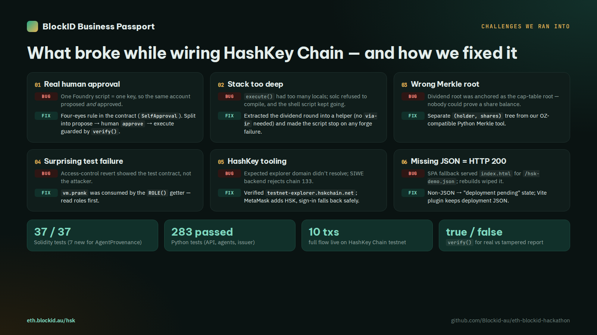

# BlockID Business Passport — technical documentation (EAG Global Buildathon, Sydney)

*Agents propose. Humans approve. Chains prove.*

> **Testnet demo. Not an offer of securities.**

**Know the business you invest in.** BlockID Business Passport gives every shareholder, large or small, a live view
of the business they own: AI-analysed, human-approved updates and valuations, an on-chain share register as proof of
ownership, and dividends paid straight to their wallet — with AI that never holds the keys.

**The investor problem:** low trust in the numbers, no tool to follow the business after investing, unclear
ownership (silent dilution), and dividends that are slow or never arrive. Clear, regular, checked answers build trust
sooner, and the business hears about problems early enough to change course.
**Next:** investors ask questions on each update, and flagged risks become questions the business must answer; the
answers become part of the recorded disclosure.

- Live app: https://eth.blockid.au · Verify: https://eth.blockid.au/verify/EBA · HashKey Chain page:
  https://eth.blockid.au/hsk · Explorer: https://scan.blockid.au
- Pitch deck (3 min): [PDF](https://eth.blockid.au/deck/BlockID-Business-Passport-3min.pdf) ·
  [PPTX](https://eth.blockid.au/deck/BlockID-Business-Passport-3min.pptx) · video (3 min): https://eth.blockid.au/deck/blockid-business-passport-3min-captions.mp4
- Repo guide: [README.md](../README.md) · Demo script: [DEMO.md](DEMO.md) · Security: [SECURITY.md](SECURITY.md) ·
  Facts: [FACTS.md](FACTS.md)

**Results (live, 27 Sep 2026):** 14 companies tokenised (CNV, ARW, GAA, SFT, MOM, ART, BVN, EHE, AST, DPT, SVI, VBC, BLC, EBA), all
anchored on 3 chains · 42 share-token contracts · A$87.1B marked valuation (median A$66.0M) · `/verify` 14 / 14 match
on all three chains · 378 automated tests (341 pytest + 37 Foundry).

Tracks entered: **Sydney Hackathon — AI x Ethereum & Agent Economy** · **Real-World Ethereum Applications** ·
**HashKey Chain (RWA / AI Agents)**.

---

## 1. Tracks and why

### Sydney Hackathon — AI x Ethereum & Agent Economy

The track asks for agent identity, agent reputation, permissioned agent wallets, safe spending policies,
AI-driven on-chain execution and AI-generated content provenance. BlockID is an *AI-driven on-chain execution*
product where the hard problem is exactly the one the track names: **how do you let agents act on real assets
(company equity, dividend money) without giving them the keys?** Our answer is a concrete, working pattern:

| Track keyword | How BlockID implements it |
|---|---|
| Agent identity | `AgentProvenance.registerAgent(agentId, name, policyHash)` — each agent has an on-chain id bound to the hash of its permission policy (`policy.py`) |
| Permissioned agent execution / wallets | Agents have **no wallet at all**. Only the isolated issuer service signs, and only for rows a human approved. On-chain, `markExecuted` reverts unless the proposal was approved |
| Safe spending / execution policies | `policy.py` whitelists tools and model tiers per agent, enforced in code before every call; `FORBIDDEN_TOOLS` = `sign_tx, send_tx, read_private_key, deploy_contract, shell`. Rate limits on valuations. Four-eyes rule on-chain: approver ≠ recorder |
| AI-driven on-chain execution | Approved valuations become share tokens, cap-table anchors, mints and dividend rounds — executed automatically by the issuer after **one** admin approval |
| AI-generated content provenance | Every AI output (valuation report, cap-table plan, dividend plan) is registered by `contentHash` + `modelId` + `uri`; `verify(id, contentHash)` proves a published report is the one a human approved. The report hash (keccak256 of the canonical report JSON) is also anchored on the share token on all three chains (`anchorValuation`) and recomputed in the browser at `/verify/:ticker` |
| Agent reputation (roadmap) | The provenance log (proposals, approvals, rejections, overrides) is the raw data for an on-chain reputation score per agent/model |

### Real-World Ethereum Applications

A live product for a real problem, not a mock: real websites crawled, real cited valuations, 14 companies issued
with 42 token contracts, the cap table anchored on **Ethereum Hoodi** (`CapTableAnchor`
`0xF3dC95D5d207dE9f2aC98184Fd32b45B72334263`), MetaMask add-token on every chain, and a public `/verify` page that
anyone can use to check a valuation report against the chain without trusting us.

### HashKey Chain track — RWA / AI Agents

Tokenised private-company equity is an RWA with a real, under-served market, and HashKey Chain's compliance
positioning fits permissioned securities. **Every company issued in the live flow is synced to HashKey Chain
testnet automatically** (paused mirror token with the same balances + cap-table Merkle root in `CapTableAnchor`
`0x728c834DE493DC3e9Ae2f7C0e79d86701B6F9F04`). In addition we deployed the **complete stack on HashKey Chain
testnet (chain id 133, RPC `https://testnet.hsk.xyz`)**: `IdentityRegistry`, `BlockIDShareToken`,
`DividendDistributor`, `DemoAUD`, `CapTableAnchor` and `AgentProvenance`, via `scripts/hsk-demo.sh`, with a
public page at https://eth.blockid.au/hsk.

| Contract | Address | Purpose |
|---|---|---|
| AgentProvenance | [`0x6B96bcE8937e1416Ec1DAC4ADAdD71FE879F8e84`](https://testnet-explorer.hskchain.net/address/0x6B96bcE8937e1416Ec1DAC4ADAdD71FE879F8e84) | AI proposal hash → human approval → execution (four-eyes) |
| BlockIDShareToken (DEM-ORD) | [`0x0107a9aF204113baD3a47a5BF23d84a3302A8cc1`](https://testnet-explorer.hskchain.net/address/0x0107a9aF204113baD3a47a5BF23d84a3302A8cc1) | Permissioned share token, 10,000 shares issued |
| IdentityRegistry | [`0x985cd14495320b1adb2Eb170B62db19b12e901Eb`](https://testnet-explorer.hskchain.net/address/0x985cd14495320b1adb2Eb170B62db19b12e901Eb) | KYC / investor eligibility |
| DividendDistributor | [`0xc0Ad2C03f04ce656Ba5820531a6E45d85C37511e`](https://testnet-explorer.hskchain.net/address/0xc0Ad2C03f04ce656Ba5820531a6E45d85C37511e) | Merkle dividend round, gasless `claimFor` |
| CapTableAnchor | [`0x728c834DE493DC3e9Ae2f7C0e79d86701B6F9F04`](https://testnet-explorer.hskchain.net/address/0x728c834DE493DC3e9Ae2f7C0e79d86701B6F9F04) | Cap-table Merkle root anchored for ticker `DEM` |
| DemoAUD (mAUD) | [`0xD40D9cb55b56b508A9Ee09E3967dAe14a6a0E058`](https://testnet-explorer.hskchain.net/address/0xD40D9cb55b56b508A9Ee09E3967dAe14a6a0E058) | Mock AUD stablecoin used for dividends |

Key transactions (the full *AI proposes → human approves → issuer executes* loop):

| Step | Tx |
|---|---|
| 1. Valuation agent's SVI report hash recorded (`propose`) | [`0x27b9f58a…`](https://testnet-explorer.hskchain.net/tx/0x27b9f58aa16754102e521de4fe1ff787ec327433eaf1df6815e60687f1c36b9f) |
| 2. Human approver wallet signs (`approve`) | [`0xc0e1821d…`](https://testnet-explorer.hskchain.net/tx/0xc0e1821d6a439536f2fc85132a53c893d07da4cacefe12eb2722b4b9a3bce9fa) |
| 3. Shares issued (guarded by `verify`) | [`0xf4d5a5e0…`](https://testnet-explorer.hskchain.net/tx/0xf4d5a5e0d623df3e28201a4eeddcbd361451e967fc6891bcbdb7644c636a9562) |
| 4. Valuation anchored on the share token | [`0x26b1484a…`](https://testnet-explorer.hskchain.net/tx/0x26b1484ade80f8a28ee452e3292d3338b58b9af08bbd2c65485187f93b5e86d4) |
| 5. Cap-table Merkle root anchored | [`0x8f984f02…`](https://testnet-explorer.hskchain.net/tx/0x8f984f02400da39e8dd105be7546dc55a3bd7c734ac4dfa025052b0c56159577) |
| 6. Dividend round funded | [`0x09932f10…`](https://testnet-explorer.hskchain.net/tx/0x09932f105dc1b879c0d82764e5c5e7eb2e4f46a629367803b081d2c530f3b7ef) |
| 7. Proposal marked executed | [`0x8896743f…`](https://testnet-explorer.hskchain.net/tx/0x8896743fc9d7f62857206ccae0ccea407fe9c03d2a71e8b5792680ffccad79e0) |
| 8. Gasless dividend claim (relayer) | [`0x89b1edc1…`](https://testnet-explorer.hskchain.net/tx/0x89b1edc1d65ed7288bc2a3d35ae6d5334b62cebddb26f6597995e070cfab349a) |

Roles: operator/issuer `0x2567Bb502ac840cF93957C60A410160a8cCb5ddf` · human approver `0xC40052702B48631C26AD7c88b499bF230faCa21F` · relayer `0x1B43f0d3297F79cE6c8BbA12F4FadFBE9112DA4a`.
SVI report hash: `0x3c273fe671ed6024caede1240085a14a67c89a2f94ee08e0f82918af24efebf4` (keccak256 of [`contracts/deployments/params/hsk-svi-report.json`](../contracts/deployments/params/hsk-svi-report.json)). Live page: https://eth.blockid.au/hsk

Against the HSK judging criteria:

- **Feasibility & real-world potential** — the platform is live, not a mock: real website crawling, real
  valuations, real contracts on three chains, working approval queue, gasless dividend claims.
- **Meaningful user/market problem** — SMEs cannot afford valuations, registries or dividend administration.
- **Technical & product innovation** — on-chain provenance + four-eyes approval of AI output as a reusable
  primitive for "AI agents × RWA", instead of trusting an agent with a key.

### Cross-track themes

- **Open-source, reusable components**: `AgentProvenance.sol`, `policy.py` (least-privilege agent policy),
  `audit.py` (hash-chained log), `safefetch.py` (SSRF-safe crawler), Python↔Solidity-compatible Merkle builder.
- **Privacy, security, user agency by design**: no PII on-chain (KYC is a hash), users sign in with their own
  wallet, humans approve with their own wallet, agents hold no keys.
- **Emerging regions**: built for Australian and Vietnamese SMEs; EN/VI UI; zero-gas operational chain so
  shareholders never need to buy gas; relayer-paid dividend claims.
- **Sustainability**: low-cost AI (free SambaNova models first, then the Claude subscription bridge, paid DeepInfra
  last; a valuation typically costs US$0 in LLM fees). Revenue: issuance fee, cap-table SaaS, transfer-agent fee per
  transfer, 0.5–1% of dividend rounds, custody via a licensed partner.

## 2. Problem and users

- **Founders / SME owners**: want a credible valuation and a clean, shareable cap table without paying a law firm
  and a valuer thousands of dollars.
- **Small shareholders (employees, angels, family)**: want to see their holding and receive dividends without
  bank-transfer admin or gas fees.
- **Platform operator / transfer agent**: must stay accountable — every AI suggestion and every execution needs an
  audit trail a regulator (ASIC) or auditor can check.

Today these cap tables live in spreadsheets; valuations are opinions without evidence; dividends are manual.

## 3. Architecture

```
┌───────────────────────────────────────────────────────────────────────────┐
│ 1. UI  (React + viem, MetaMask, SIWE EIP-4361, EN/VI)                     │
│    /start · /v/:id/:step · /c/:ticker/:section · /verify · /admin/:queue  │
└──────────────────────────────┬────────────────────────────────────────────┘
                               │ HTTPS, session cookie, CSRF origin check
┌──────────────────────────────▼────────────────────────────────────────────┐
│ 2. AGENT LAYER — no keys, no wallets                                      │
│    LangGraph `site_valuation`: read_site → profile → competitors →        │
│    market → svi → narrative → [gate_valuation: interrupt()]               │
│    policy.py guard(): per-agent tools + model tiers; FORBIDDEN_TOOLS      │
│    safefetch.py (public IPs only, per-hop redirect checks, size/time caps)│
│    Outputs: Pydantic-validated objects; every claim cites a fetched URL   │
└──────────────────────────────┬────────────────────────────────────────────┘
                               │ rows in Postgres (status = pending)
┌──────────────────────────────▼────────────────────────────────────────────┐
│ 3. CONTROL PLANE                                                          │
│    agents-api: approval queue; admin approves (SIWE wallet or account)    │
│    issuer service: only key holder, isolated docker networks, internal    │
│    token; atomically claims *approved* rows; checks on-chain results      │
│    before retry; records tx hashes as events                              │
│    audit: hash-chained JSONL log + studio.audit table                     │
└──────────────────────────────┬────────────────────────────────────────────┘
                               │ signed transactions
┌──────────────────────────────▼────────────────────────────────────────────┐
│ 4. CHAINS                                                                 │
│    BlockID EVM 262626 (zero gas): operational register + dividends        │
│    Ethereum Hoodi 560048: CapTableAnchor Merkle roots, paused mirrors     │
│    HashKey Chain testnet 133: roots + paused mirrors, RWA stack,          │
│      AgentProvenance                                                      │
└───────────────────────────────────────────────────────────────────────────┘
```

### Lifecycle of one company

1. Founder signs in with MetaMask and submits a website (+ optional self-reported metrics).
2. Worker runs the valuation graph (≤ 6 pages, ≤ 3 web searches; LLM chain SambaNova → Claude bridge → DeepInfra);
   SVI index, band and low/mid/high valuation are computed by code; LLM-suggested qualitative scores are labelled
   `ai_suggested`. The graph stops at `gate_valuation`.
3. Admin reviews evidence, approves or overrides scores (overrides become `human`).
4. Founder creates the company: name, ticker (suggested), holders and percentages (validated to sum to 100%,
   EIP-55 addresses). Total shares = valuation mid / A$1.00.
5. Admin gives **one issuance approval** → issuer deploys `IdentityRegistry`, `BlockIDShareToken`,
   `DividendDistributor`, registers KYC for each holder, issues shares and anchors the report hash (keccak256 of the
   canonical report JSON) on BlockID EVM.
6. Automatically, in the same run → issuer mirrors balances on Ethereum Hoodi and then HashKey Chain testnet (paused
   token, same report hash) and anchors the cap-table Merkle root in `CapTableAnchor` on each. A failed chain shows
   its error on the tracker; an admin re-sync re-runs only that chain.
7. Later: mint requests and dividend plans follow the same propose → approve → execute path; dividends are paid
   via `claimFor` by a relayer so holders pay nothing.

With `AgentProvenance`, each "propose" step also creates an on-chain proposal, the human approval is an on-chain
transaction from the approver's wallet, and the execution tx is linked back with `markExecuted`.

## 4. Agent safety model

| Layer | Control | Where |
|---|---|---|
| Capability | No private key, wallet or signing tool exists in the agent runtime | `policy.py` `FORBIDDEN_TOOLS`, container isolation |
| Least privilege | Per-agent allow-list of tools and model tiers; PII-handling agents are local-tier only | `policy.POLICIES`, `guard()` |
| Deterministic maths | SVI index and valuation computed by code; LLM only suggests qualitative scores | `tools/svi.py`, `agents/valuation.py` |
| Prompt injection | Web content treated as untrusted data; schema-validated outputs; uncited claims dropped | agents, `schemas.py` |
| Network | SSRF-safe crawler; worker cannot reach the issuer network | `tools/safefetch.py`, docker networks |
| Human-in-the-loop | LangGraph `interrupt()` valuation gate + one admin issuance approval; separate approvals for mint / dividend | `graph.py`, studio routes |
| Four-eyes on-chain | Approver wallet ≠ recorder (issuer) wallet; `markExecuted` requires approval | `AgentProvenance.sol` |
| Execution integrity | Issuer atomically claims only approved rows; retries check chain state first | `issuer/service.py` |
| Auditability | Hash-chained audit log, on-chain events, report hashes anchored on the token | `audit.py`, contracts |
| Abuse limits | 3 valuations / wallet / day, 60 / day globally, max 5 active | studio config |

## 5. Smart contracts

| Contract | Purpose |
|---|---|
| `IdentityRegistry` | wallet → KYC status, country, expiry; stores only a hash of the KYC record; ERC-3643-style `isVerified()` |
| `BlockIDShareToken` | 1 token = 1 share (`decimals = 0`); transfers only between verified wallets; lock-up, freeze, pause, holder cap, `forcedTransfer`, `anchorValuation(reportHash, perShareCents)`; roles `ISSUER_ROLE`, `TRANSFER_AGENT_ROLE`, `PAUSER_ROLE` |
| `DividendDistributor` | per-round Merkle root, stablecoin payout, `claim` / gasless `claimFor` via relayer, `closeRound` reclaims unclaimed funds after the deadline |
| `CapTableAnchor` | `anchor(ticker, localToken, localChainId, localBlock, merkleRoot, totalSupply, uri)`; `verify(ticker, holder, balance, proof)` lets anyone prove a holding |
| `DemoAUD` | testnet stablecoin (6 decimals, owner-mintable) for dividends |
| `AgentProvenance` *(hackathon)* | AccessControl with `REGISTRAR_ROLE`, `RECORDER_ROLE` (issuer service), `APPROVER_ROLE` (human admin wallet). `registerAgent(agentId, name, policyHash)`; `propose(agentId, kind, contentHash, modelId, uri) → proposalId` (recorder); `approve(id)` / `reject(id, reason)` by an approver who must differ from the recorder; `markExecuted(id, executionRef)` only after approval; `verify(id, contentHash)` view |

Tooling: Foundry, Solidity 0.8.28, OpenZeppelin v5.4.0, unit + fuzz tests, Slither in CI.

## 6. HashKey Chain integration

- **Network**: HashKey Chain testnet, chain id **133**, RPC `https://testnet.hsk.xyz`.
- **Deployment**: `scripts/hsk-demo.sh` deploys the RWA stack and `AgentProvenance`, runs the demo flow and writes
  `contracts/deployments/out/hsk-demo.json`, which the web page https://eth.blockid.au/hsk reads.
- **Keys**: deployer and relayer are encrypted Foundry keystores; no private key is in the repo or the script.
- **Same bytecode, three chains**: contracts are chain-agnostic; the chain is selected by RPC/chain id.
- **Why HSK for production RWA**: a compliance-oriented L2 with an institutional ecosystem is a natural home for
  a permissioned share token whose holders must be KYC-verified.

## 7. Key features (summary)

AI valuation with evidence (SVI) · one human issuance approval · `/verify` report-hash check on three chains · permissioned share tokens · Merkle dividends with gasless
claims · cross-chain cap-table anchoring and holder proofs · on-chain agent provenance and four-eyes approval ·
hash-chained audit · SIWE wallet login · EN/VI UI · zero-gas operational chain.

## 8. What was built during the hackathon vs before

Honest scope statement:

- **Before the hackathon** (existing BlockID platform, codename Issuance Studio): the agent pipeline (LangGraph,
  SVI, policy, audit), the web app and API, the issuer service, the share-token / identity / dividend / anchor
  contracts, the BlockID EVM chain and Blockscout explorer, and the Ethereum Hoodi anchoring.
- **During the hackathon (26 Sep 2026)**:
  - `AgentProvenance.sol` — on-chain agent identity, AI-output provenance and four-eyes human approval;
  - deployment of the full RWA stack + `AgentProvenance` on **HashKey Chain testnet** (`scripts/hsk-demo.sh`) and
    the `/hsk` page;
  - **one issuance approval → three chains**: automatic sync BlockID → Hoodi → HashKey with per-chain status, a live
    issuance tracker and admin re-sync;
  - the **canonical report hash** (keccak256 of the canonical report JSON) anchored on all three chains and the
    public **`/verify`** page with a tamper test;
  - a **3-search research budget** with the Claude web-search bridge, and the **SambaNova → Claude bridge →
    DeepInfra** LLM chain (benchmark in [LLM-ROUTING.md](LLM-ROUTING.md));
  - 14 companies issued and anchored on three chains (42 token contracts);
  - English documentation for judges: README, this document, DEMO, FEATURES (40 screenshots), 12 architecture
    diagrams, user guide, 3-minute pitch deck and demo video.

## 9. Roadmap

Ranked by impact ÷ effort in [ROADMAP-RESEARCH.md](ROADMAP-RESEARCH.md):

1. **Safe 2-of-3 as admin** on all three chains; the issuer keeps only narrow roles.
2. **Invariant + static-analysis CI** (Foundry invariants, Aderyn, Halmos).
3. **On-chain alerting and end-to-end tracing.**
4. **Valuation eval + red-team harness** and **EAS valuation attestations**.
5. **Calibrated revenue multiples + backtest.**
6. **Legal path**: licensed CSF intermediary / AFSL partner (see [SECURITY.md](SECURITY.md)).
7. **Scoped agent permissions**: Safe + Zodiac Roles on HashKey Chain; session keys (EIP-7702 / ERC-7579, 4337
   stack) on Ethereum.
8. **Real KYC** and **ERC-8004 agent identity/reputation** computed from the `AgentProvenance` history.
9. Later: official ERC-3643 + ONCHAINID and an independent audit, real stablecoin dividends and HashKey mainnet, ZK
   selective disclosure of KYC, multi-validator BlockID chain, open-source SDK of the provenance + approval pattern.

> **Testnet demo. Not an offer of securities.** Not legal or financial advice.


## Visual summary



