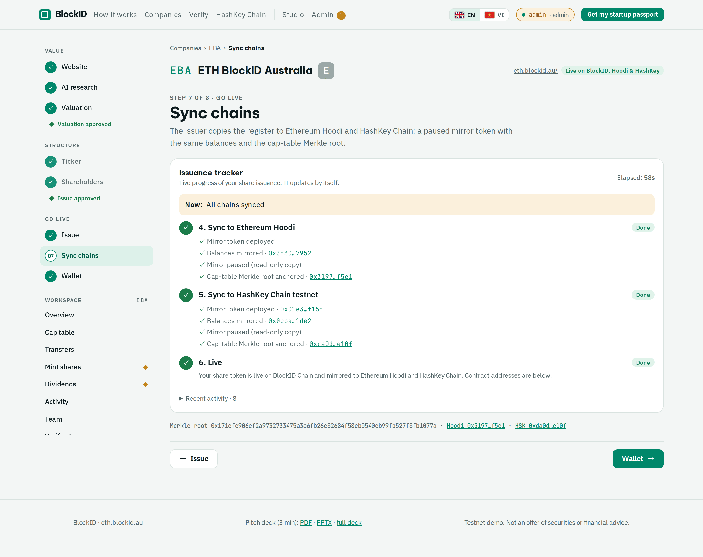
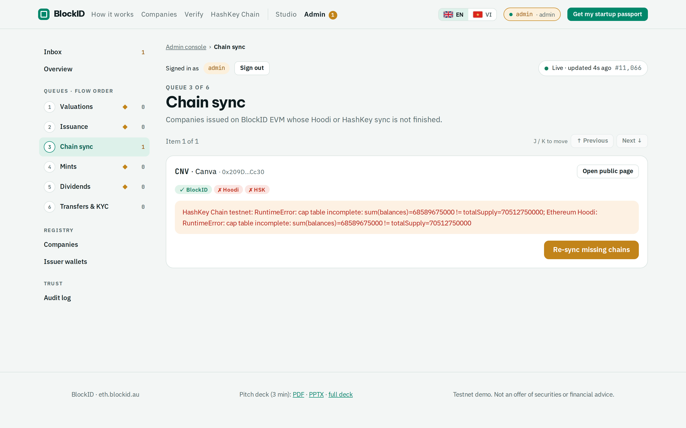

# BlockID Startup Passport: user guide

> **Testnet only. Not an offer of securities.** Every token, balance and dividend in this guide lives on test
> networks and has no monetary value.

This guide walks through the platform task by task, with screenshots from the live app at
**https://eth.blockid.au**. For a screen-by-screen tour see [FEATURES.md](FEATURES.md); for every contract address
see [DEPLOYMENTS.md](DEPLOYMENTS.md).

**Contents**

1. [Before you start](#1-before-you-start)
2. [Value a startup](#2-value-a-startup)
3. [Tokenise the company](#3-tokenise-the-company)
4. [Admin: approve, issue, sync](#4-admin-approve-issue-sync)
5. [Shareholders: see and hold your shares](#5-shareholders-see-and-hold-your-shares)
6. [Issue new shares (a new round)](#6-issue-new-shares-a-new-round)
7. [Pay a dividend](#7-pay-a-dividend)
8. [Transfers and KYC](#8-transfers-and-kyc)
9. [Verify a valuation yourself](#9-verify-a-valuation-yourself)
10. [Explorers and HashKey Chain](#10-explorers-and-hashkey-chain)
11. [Operators: keeping everything in sync](#11-operators-keeping-everything-in-sync)
12. [Troubleshooting](#12-troubleshooting)

---

## 1. Before you start

### Roles

| Role | What they do | How they sign in |
|---|---|---|
| **Founder / requester** | Requests a valuation, proposes the ticker and cap table, requests mints and dividends | MetaMask (Sign-In with Ethereum) |
| **Admin** | Reviews AI scores, approves issuance, mints, dividends, transfers and KYC | Admin wallet (MetaMask) or the admin account |
| **Shareholder / investor** | Holds shares, imports the token, claims dividends, requests transfers | MetaMask |
| **Anyone** | Browses companies, verifies valuations, reads the explorers | No sign-in |

AI agents never hold keys. Only the isolated **issuer service** signs transactions, and only for rows an admin has
approved.

### Networks

| Network | Chain ID | RPC | Currency | Explorer | Role |
|---|---|---|---|---|---|
| BlockID Chain | 262626 (`0x401e2`) | `https://eth.blockid.au/rpc` | BLKD (18 decimals) | https://scan.blockid.au | register of record; zero gas price |
| Ethereum Hoodi | 560048 | `https://ethereum-hoodi-rpc.publicnode.com` | ETH | https://hoodi.etherscan.io | paused mirror + Merkle anchor |
| HashKey Chain testnet | 133 | `https://testnet.hsk.xyz` | HSK | https://testnet-explorer.hskchain.net | paused mirror + Merkle anchor, `AgentProvenance` |

The company page adds BlockID Chain to MetaMask for you (section 5). BlockID Chain transactions cost **0 gas**.

### Language

Use the **EN / VI** switch in the header. Everything, including the valuation report, is available in both.

### How the app is organised

Every task has its own screen and URL, so you can reload, bookmark or send a link to exactly where you are.

| Area | Where | What is on the left rail |
|---|---|---|
| **Founder flow** | `/start` → `/v/<id>/research` → `/v/<id>/report` → `/v/<id>/ticker` → `/v/<id>/holders` → `/c/<TICKER>/issue` → `/c/<TICKER>/sync` → `/c/<TICKER>/wallet` | The 8 steps in 3 phases (Value, Structure, Go live) and the two human gates ◆ |
| **Company workspace** | `/c/<TICKER>/overview`, `/cap-table`, `/transfers`, `/mint`, `/dividends`, `/activity`, `/team`, plus `/verify/<TICKER>` | The same 8 steps (done ✓) and the workspace sections |
| **Admin console** | `/admin` (inbox), `/admin/dashboard`, `/admin/<queue>/<item>`, `/admin/companies/<TICKER>`, `/admin/wallets`, `/admin/audit` | Inbox, then the queues in flow order with a count each, then registry and audit |
| **Public** | `/`, `/companies`, `/verify`, `/hsk` | none |

- Every screen ends with a **pager**: the previous step on the left, the next step on the right. When the next
  step is locked, the pager says why (for example "The next step opens when an admin approves the valuation").
  The ← and → keys do the same.
- **Gates (gold ◆)** are the two places where a person must approve: after the valuation report (step 3) and after
  the shareholder list (step 5). The rail shows each gate as waiting, approved or rejected.
- At a gate, **Open this item in the admin console** takes an admin straight to that item
  (`/admin/valuations/<id>` or `/admin/issuance/<TICKER>`). After **Approve**, the console returns to the founder's
  next step.
- The flow moves on by itself: when the AI research finishes you land on the report, and while the issuer works
  the page moves from *Issue* to *Sync chains* to *Wallet*.
- Old links (`/new`, `/v/<id>`, `/c/<TICKER>`, `/admin`) still work and open the right step.

---

## 2. Value a startup

**Where:** https://eth.blockid.au/start (step 1) · **Who:** anyone with a wallet (3 valuations per wallet per day).

1. Click **Connect wallet** and sign the login message in MetaMask (no transaction, no gas).
2. Paste the company's public website, for example `https://www.airwallex.com/`, and optionally add
   self-reported metrics (revenue, growth, customers). Self-reported numbers are labelled *not verified*.
3. Start the valuation. The agents read the site, find competitors, search the market and score the company.
   It takes about 1–3 minutes; the page updates by itself.

The page moves to step 2, **AI research** (`/v/<id>/research`). While it runs you see the agent log: each step, how many searches it used and which sources it read.

### Read the report

When the research finishes, the page opens step 3, **Valuation** (`/v/<id>/report`), by itself. The report
goes straight to the admin queue (gate 1); the pager keeps step 4 locked and says why until an admin approves.

- **SVI index and grade (A–E)** with a contribution chart for the 7 dimensions (Founder, Product, Market, Revenue,
  Growth, Investment readiness, Trust). Revenue and growth are computed by code; the other five are
  **AI-suggested** and must be confirmed by an admin.
- **Valuation range** (low / mid / high, A$) and the competitors that were found.
- **Narrative and evidence**: every claim links to a fetched source. Uncited claims are dropped automatically.
- **Warnings**: what the agent could not verify (for example "no public revenue").

A public sample report is at https://eth.blockid.au/v/sample/report.

> The valuation is an indicative index, not financial advice. Companies that publish no revenue get a low score
> by design; the admin can adjust the five qualitative scores before approving.

---

## 3. Tokenise the company

**Where:** steps 4–8 of the flow, after an admin has approved the valuation · **Who:** the requester or an admin.

1. Step 4, **Ticker** (`/v/<id>/ticker`): enter the company name and pick a free 3-letter ticker (suggestions are
   shown). The pager's **Shareholders →** stays locked until both are set.
2. Step 5, **Shareholders** (`/v/<id>/holders`): **Add holder** for each holder (name + wallet). Wallets must be
   valid EIP-55 addresses and percentages must add up to 100%. The default supply is *valuation mid ÷ A$1.00*.
3. Click **Create & submit for approval**. This is gate 2: the flow opens step 6, **Issue** (`/c/<TICKER>/issue`),
   which shows *Waiting for admin approval* until an admin gives the one issuance approval.
4. After approval the issuer works on its own. Step 6 shows the BlockID Chain transactions; when they are done
   the page moves to step 7, **Sync chains** (Hoodi and HashKey), then step 8, **Wallet**, with the contract
   addresses and **Add to MetaMask**.

---

## 4. Admin: approve, issue, sync

**Where:** https://eth.blockid.au/admin · **Who:** wallets on the admin list, or the admin account.

### Inbox and queues

The console opens on the **Inbox**: how many items wait in each queue and a **Next step** card that opens the
oldest one. The left rail lists the queues **in the order a company moves through the flow**, each with its
count; ◆ marks a human gate.

| # | Queue | URL | What approving does |
|---|---|---|---|
| 1 ◆ | **Valuations** | `/admin/valuations/<id>` | Approves the AI report. **Open full report** first to check evidence or adjust any of the five AI scores (*Admin review*) |
| 2 ◆ | **Issuance** | `/admin/issuance/<TICKER>` | One approval: the issuer deploys the identity registry, share token and dividend distributor on BlockID Chain, KYCs every holder, issues the shares, anchors the report hash, then mirrors to Hoodi and HashKey and anchors the cap-table Merkle root |
| 3 | **Chain sync** | `/admin/sync/<TICKER>` | **Re-sync missing chains** for a company whose Hoodi or HashKey sync failed |
| 4 ◆ | **Mints** | `/admin/mints/<id>` | KYC for the new holder, mint on BlockID Chain, re-sync both mirrors and re-anchor (~80 s) |
| 5 ◆ | **Dividends** | `/admin/dividends/<id>` | Funds a Merkle round in the distributor; holders claim, the relayer pays their gas |
| 6 | **Transfers & KYC** | `/admin/transfers` | Approval-mode transfers (`forcedTransfer`) and KYC registrations |

Each queue shows **one item at a time** with *Item 2 of 5*, **Previous / Next** (or the J and K keys) and the
list of all items below. After **Approve** or **Reject** the next item opens. If you came from a founder's gate
link, a banner says so and **Approve** takes you back to the founder's next step.

The issuer runs **one job at a time**. Bulk approvals are safe: they queue and run in order.

### Dashboard

KPIs, service-wallet balances on all three chains, tokenised companies and recent activity (`/admin/dashboard`).

### Registry and audit

- **Companies** (`/admin/companies/<TICKER>`): pick a row to see its mark chart and sync state per chain,
  **Revalue** it, or **Re-sync missing chains**.
- **Issuer wallets** (`/admin/wallets`): grant or revoke wallets that may submit companies.
- **Audit log** (`/admin/audit`): every login, approval and issuer action, hash-chained.

---

## 5. Shareholders: see and hold your shares

**Where:** https://eth.blockid.au/companies and the company workspace `https://eth.blockid.au/c/<TICKER>/overview`.

The workspace has one screen per task (left rail, **Workspace** group):

- **Overview**: a *Next step* card, KPIs (valuation, shares, KYC-verified holders, last anchor block) and the
  share-mark chart.
- **Cap table** (`/cap-table`): balances read live from BlockID Chain, with an ownership chart.
- **Wallet** (step 8, `/wallet`): contract addresses on all three chains, with QR codes and explorer links.
- **Transfers**, **Mint shares**, **Dividends**, **Activity** and **Team**. Screens you cannot use are greyed out
  with the reason (for example *For company admins only*).

### Add the token to MetaMask

1. Click **Add to MetaMask** on the BlockID Chain card. MetaMask asks to add the network (chain 262626, BLKD) and
   then the token.
2. Or add it manually: network values from section 1, then **Tokens → Import tokens** with the contract address.

Mirrors on Hoodi and HashKey are **paused** read-only copies; the live, transferable token is on BlockID Chain.

---

## 6. Issue new shares (a new round)

**Where:** workspace → **Mint shares** (`/c/<TICKER>/mint`) · **Who:** the company owner wallet or an admin.

1. Enter the **recipient wallet**, a **holder name** (anonymised labels such as `Seed investor 01` are fine) and the
   number of **new shares**. The preview shows the dilution for existing holders.
2. Click **Request approval**. It appears in the admin **Mints** queue (`/admin/mints`).
3. After approval, the new holder appears in the cap table and the supply updates on all three chains.

Example: Airtasker (ART) after ten approved mints to anonymised holders.

And Airwallex (ARW): three original holders plus twelve anonymised holders.

---

## 7. Pay a dividend

**Where:** workspace → **Dividends** (`/c/<TICKER>/dividends`) · **Who:** owner or admin; an admin approves.

1. Enter the **Total (mAUD)**. The server snapshots balances at the record block, splits pro rata (rounded down;
   the remainder stays with the issuer) and computes a Merkle root. The claim deadline is 30 days.
2. After approval, holders claim their share; the relayer pays their gas (`claimFor`).
3. The activity feed shows every round and claim.

---

## 8. Transfers and KYC

Every receiver must be KYC-verified in the company's identity registry. Each company has a transfer mode, set by an
admin:

| Mode | Token state | How a holder transfers |
|---|---|---|
| **Admin approval required** (default) | paused | Sign in with the holding wallet, open the workspace **Transfers** screen (`/c/<TICKER>/transfers`), enter **Receiver wallet** and **Receiver name**, then **Submit for approval**; an admin approves and the issuer runs `forcedTransfer` |
| **Free transfer** | unpaused | Same panel, **Sign transfer in MetaMask**; the app records the tx hash and re-syncs the register and mirrors |

The panel checks the transfer first (KYC, lock-up, frozen wallet, shareholder cap, balance) and explains any problem,
for example *Receiver is not KYC-verified*. A new investor clicks **Request KYC** for their wallet on the company
page; an admin approves it in **Admin → Transfers & KYC**. **Transfer history** lists every transfer.

---

## 9. Verify a valuation yourself

**Where:** `https://eth.blockid.au/verify/<TICKER>` · **Who:** anyone, no sign-in.

The page recomputes the SVI index and the report hash **in your browser** from the published formula, then compares
the hash with the value anchored on BlockID Chain, Hoodi and HashKey.

**Tamper test:** change one score and the hash no longer matches.

---

## 10. Explorers and HashKey Chain

- **BlockID explorer** (Blockscout): https://scan.blockid.au. Search a token address, then open **Holders**.
- **HashKey page**: https://eth.blockid.au/hsk shows the HashKey testnet contracts, `AgentProvenance` (four-eyes
  record of agent actions) and dividend transactions.

The app also works on phones:

  
  
  

---

## 11. Operators: keeping everything in sync

Run these on the app VM from the repository root. Details: [RUNBOOK-STUDIO.md](RUNBOOK-STUDIO.md).

| Task | Command |
|---|---|
| Regenerate the token / contract list (reads Postgres + all three chains) | `agents/.venv/bin/python scripts/export-deployments.py` → [DEPLOYMENTS.md](DEPLOYMENTS.md) |
| Retake every screenshot (read-only tour, Docker) | `scripts/screenshots/run.sh` (subset: `ONLY='^1[5-8]' scripts/screenshots/run.sh`) |
| Change the LLM order | edit `LLM_PROVIDER_ORDER`, `SAMBANOVA_MODELS`, `DEEPINFRA_MODELS` in `/opt/blockid/app.env`, then recreate `agents-worker` ([LLM-ROUTING.md](LLM-ROUTING.md)) |
| Restart the Claude search / completion bridge | `sudo systemctl restart claude-search-bridge` (health: `curl http://172.18.0.1:8765/healthz`) |
| Check BlockID Chain gas | `cast gas-price --rpc-url http://127.0.0.1:8545` (0) and `curl 127.0.0.1:1317/cosmos/evm/feemarket/v1/params` |

Demo holder wallets created on the server live in `~/.blockid/holder-wallets/` as encrypted Foundry keystores
(`ART/`, `ARW/`, `password`, `index.tsv` with label → address). They are never in the repository.

---

## 12. Troubleshooting

| Symptom | Cause and fix |
|---|---|
| "Daily limit reached" on /start | 3 valuations per wallet per day. Use another wallet or ask an admin. |
| Valuation shows "no market data" | Brave quota exhausted; search falls back to Claude web search automatically. If both fail the valuation still completes with a warning. |
| Low SVI for a well-known company | Revenue and growth come from published numbers only. Add self-reported metrics or let the admin adjust scores. |
| Issuance or mint seems stuck | The issuer runs one job at a time; check the tracker's "Now:" line and the admin overview. Failed chains can be retried with **Re-sync missing chains**. |
| MetaMask shows a token on Hoodi/HashKey you cannot send | Mirrors are paused by design; transfer on BlockID Chain. |
| MetaMask asks for gas on BlockID Chain | Set the gas price to 0; BLKD fees are zero. |
